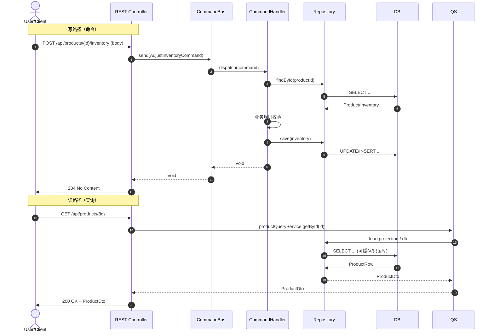
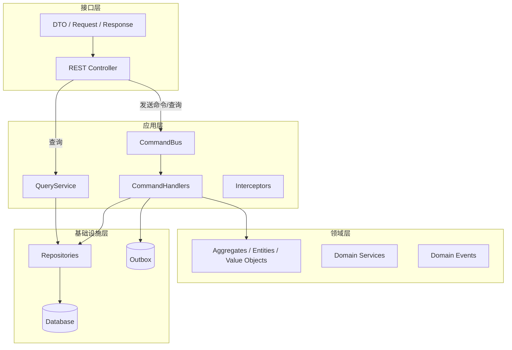

# 从 MVC 到 DDD：渐进式架构演进指南

<!-- TOC -->
- [从 MVC 到 DDD：渐进式架构演进指南](#从-mvc-到-ddd渐进式架构演进指南)
  - [适用人群](#适用人群)
  - [本文愿景](#本文愿景)
  - [技术栈说明](#技术栈说明)
  - [第一章：为什么需要改变 - MVC 的实际困境](#第一章为什么需要改变---mvc-的实际困境)
    - [1.1 一个典型的 MVC 项目](#11-一个典型的-mvc-项目)
    - [1.2 随着项目演进，问题逐渐显现](#12-随着项目演进问题逐渐显现)
      - [场景一：临时修改导致的混乱](#场景一临时修改导致的混乱)
      - [场景二：Service 层方法激增](#场景二service-层方法激增)
      - [场景三：职责不清的困境](#场景三职责不清的困境)
    - [1.3 更深层的问题：Controller 和 Service 的紧耦合](#13-更深层的问题controller-和-service-的紧耦合)
    - [1.4 查询操作 vs 命令操作：被忽视的差异](#14-查询操作-vs-命令操作被忽视的差异)
    - [1.5 小结：我们需要什么改变？](#15-小结我们需要什么改变)
  - [第二章：命令模式的引入 - 封装业务意图](#第二章命令模式的引入---封装业务意图)
    - [2.1 为什么需要命令模式？](#21-为什么需要命令模式)
    - [2.2 命令模式的基本概念](#22-命令模式的基本概念)
    - [2.3 第一步：定义命令对象](#23-第一步定义命令对象)
    - [2.4 第二步：定义命令处理器](#24-第二步定义命令处理器)
    - [2.5 第三步：重构 Controller（采用标准 HTTP 语义）](#25-第三步重构-controller采用标准-http-语义)
    - [2.6 我们获得了什么？](#26-我们获得了什么)
    - [2.7 实战：命令验证（组合建议）](#27-实战命令验证组合建议)
      - [可视化：写/读路径时序图](#可视化写读路径时序图)
    - [2.8 小结](#28-小结)
  - [第三章：中介者/命令总线 - 统一命令调度（强类型单播）](#第三章中介者命令总线---统一命令调度强类型单播)
    - [3.1 当前代码的问题](#31-当前代码的问题)
    - [3.2 命令(Command) vs 事件(Event)：为何不混用？](#32-命令command-vs-事件event为何不混用)
    - [3.3 第一步：定义强类型命令与处理器](#33-第一步定义强类型命令与处理器)
    - [3.4 第二步：实现强类型命令总线（单播、可返回值）](#34-第二步实现强类型命令总线单播可返回值)
    - [3.5 第三步：实现命令处理器（应用服务）](#35-第三步实现命令处理器应用服务)
    - [3.6 重构后的 Controller（依赖 CommandBus 与 QueryService）](#36-重构后的-controller依赖-commandbus-与-queryservice)
    - [3.7 横切关注点：拦截器/AOP](#37-横切关注点拦截器aop)
    - [3.8 处理查询（CQRS）](#38-处理查询cqrs)
    - [3.9 项目结构建议](#39-项目结构建议)
      - [可视化：分层与依赖方向](#可视化分层与依赖方向)
    - [3.10 小结](#310-小结)
    - [3.11 下一步](#311-下一步)
    - [3.12 当前边界](#312-当前边界)
<!-- /TOC -->

## 适用人群

- 熟悉 Spring Boot 和 MVC 架构的 Java 开发者
- 对领域驱动设计（DDD）感兴趣，但不知从何入手
- 希望理解 DDD 项目结构和设计理念
- 想要改进现有 MVC 项目架构的开发者

## 本文愿景

完全的 MVC 和纯粹的 DDD 就像光谱的两端，从一端走向另一端的过程中，有诸多概念和设计决策可供选择。**没有架构是银弹**，只有最适合业务需求的架构才是最好的架构。

本文档最终希望画出一条坐标轴，以帮助开发者在 MVC 和 DDD 之间找到合适的平衡点，根据实际需求逐步引入 DDD 的核心理念和实践。

## 技术栈说明

- **MVC 基准**：Spring Boot 3.x
- **DDD 实践**：结合 Wow 框架（https://wow.ahoo.me/）
- **Java 版本**：Java 17+（使用 Record 等现代特性）

---

## 第一章：为什么需要改变 - MVC 的实际困境

### 1.1 一个典型的 MVC 项目

让我们从一个真实的 Spring Boot 项目开始。这是一个库存管理系统的典型代码：

**Controller 层：**

```java
@RestController
@RequestMapping("/api/products")
public class ProductController {

    private final ProductService productService;

    public ProductController(ProductService productService) {
        this.productService = productService;
    }

    /**
     * 调整产品库存
     */
    @PostMapping("/{productId}/inventory")
    public ResponseEntity<Void> adjustInventory(
            @PathVariable UUID productId,
            @RequestBody AdjustInventoryRequest body) {
        productService.adjustInventory(productId, body.quantity(), body.warehouse(), body.reason());
        return ResponseEntity.noContent().build();
    }
    
    /**
     * 获取产品详情
     */
    @GetMapping("/{productId}")
    public ResponseEntity<ProductDto> getProduct(
            @PathVariable UUID productId) {
        ProductDto product = productService.getProductById(productId);
        return ResponseEntity.ok(product);
    }
}
```

**Service 层：**

```java
@Service
public class ProductService {
    
    private final ProductRepository productRepository;
    private final InventoryRepository inventoryRepository;
    private final Clock clock;

    public ProductService(ProductRepository productRepository,
                          InventoryRepository inventoryRepository,
                          Clock clock) {
        this.productRepository = productRepository;
        this.inventoryRepository = inventoryRepository;
        this.clock = clock;
    }
    
    @Transactional
    public void adjustInventory(UUID productId, Integer quantity, 
                                String warehouse, String reason) {
        // 1. 查询产品
        Product product = productRepository.findById(productId)
            .orElseThrow(() -> new ProductNotFoundException(productId));
        
        // 2. 查询库存
        Inventory inventory = inventoryRepository
            .findByProductIdAndWarehouse(productId, warehouse)
            .orElseThrow(() -> new InventoryNotFoundException(productId, warehouse));
        
        // 3. 业务规则检查
        if (quantity < 0 && inventory.getQuantity() + quantity < 0) {
            throw new InsufficientStockException(
                "库存不足，当前: " + inventory.getQuantity() + ", 请求: " + quantity
            );
        }
        
        // 4. 更新库存
        inventory.setQuantity(inventory.getQuantity() + quantity);
        inventory.setLastModified(LocalDateTime.now(clock));
        inventoryRepository.save(inventory);
        
        // 5. 记录日志
        logInventoryChange(productId, warehouse, quantity, reason);
    }
    
    public ProductDto getProductById(UUID productId) {
        Product product = productRepository.findById(productId)
            .orElseThrow(() -> new ProductNotFoundException(productId));
        return ProductDto.from(product); // 统一返回 DTO
    }
    
    private void logInventoryChange(UUID productId, String warehouse, 
                                    Integer quantity, String reason) {
        // 日志记录逻辑（示例）
        LocalDateTime occurredAt = LocalDateTime.now(clock);
        // ...
    }
}
```

看起来还不错？分层清晰，职责明确。确实，对于简单的项目，这样的结构完全够用。

### 1.2 随着项目演进，问题逐渐显现

#### 场景一：临时修改导致的混乱

某天，产品经理提了个紧急需求："库存不足时，给采购部门发个通知"。时间紧迫，开发者直接在 Controller 里加了代码：

```java
@PostMapping("/{productId}/inventory")
public ResponseEntity<Void> adjustInventory(...) {
    // ❌ 在 Controller 中直接处理业务异常
    try {
        productService.adjustInventory(productId, quantity, warehouse, reason);
    } catch (InsufficientStockException e) {
        // 紧急加的需求：发送通知
        notificationService.sendStockAlert(productId);
        return ResponseEntity.status(HttpStatus.BAD_REQUEST).build();
    }
    return ResponseEntity.noContent().build();
}
```

又过了几天，另一个开发者在另一个 Controller 里也需要调整库存，他不知道第一个开发者的修改，直接调用了 Service：

```java
@PostMapping("/orders/{orderId}/confirm")
public ResponseEntity<Void> confirmOrder(...) {
    // ❌ 这里调整库存，但不会发送通知
    productService.adjustInventory(productId, quantity, warehouse, "订单确认");
    // ...
    return ResponseEntity.noContent().build();
}
```

**结果：** 同样的业务逻辑，在不同的地方有不同的实现，行为不一致。

#### 场景二：Service 层方法激增

随着业务发展，ProductService 里的方法越来越多：

```java
@Service
public class ProductService {
    // 库存相关
    public void adjustInventory(...) { }
    public void reserveInventory(...) { }
    public void releaseInventory(...) { }
    public void transferInventory(...) { }
    public void returnInventory(...) { }
    public void lockInventory(...) { }
    public void unlockInventory(...) { }
    
    // 产品相关
    public void createProduct(...) { }
    public void updateProduct(...) { }
    public void deleteProduct(...) { }
    public void updateProductPrice(...) { }
    public void updateProductCategory(...) { }
    
    // 查询相关
    public Product getProductById(...) { }
    public List<Product> getProductsByCategory(...) { }
    public List<Product> searchProducts(...) { }
    public PageResult<Product> getProductsPage(...) { }
    
    // ... 30+ 个方法
}
```

**问题：**
- 一个 Service 类几千行代码，难以维护
- 修改一个功能可能影响其他功能
- 新人接手项目时，不知道从哪看起

#### 场景三：职责不清的困境

作为团队 Leader，你在代码审查时看到新同事的代码：

```java
// 新同事的代码：在 Controller 里做参数校验
@PostMapping("/{productId}/inventory")
public ResponseEntity<Void> adjustInventory(...) {
    if (quantity == 0) {
        return ResponseEntity.badRequest().build();
    }
    // ...
    return ResponseEntity.noContent().build();
}
```

你说："参数校验应该在 Service 层做，Controller 只负责接收请求。"

新同事改了：

```java
// 新同事改后的代码：把校验移到 Service
@Service
public class ProductService {
    public void adjustInventory(...) {
        if (quantity == 0) {
            throw new IllegalArgumentException("调整数量不能为0");
        }
        // ...
    }
}
```

但另一个老员工说："参数校验应该用 Bean Validation 在入参时就做，不应该进 Service。"

第三个同事说："简单的参数校验可以在 Controller，复杂的业务规则校验应该在 Service。"

**结果：** 团队内部对职责划分没有共识，每个人的写法都不一样。

### 1.3 更深层的问题：Controller 和 Service 的紧耦合

回到最初的代码：

```java
@RestController
@RequestMapping("/api/products")
public class ProductController {
    @Autowired
    private ProductService productService;
    
    @PostMapping("/{productId}/inventory")
    public ResponseEntity<Void> adjustInventory(...) {
        productService.adjustInventory(productId, quantity, warehouse, reason);
        return ResponseEntity.noContent().build();
    }
}
```

这段代码有什么问题？

**问题 1：Controller 直接依赖具体的 Service 类**
- 测试 Controller 时必须准备好 ProductService
- ProductService 的任何修改都可能影响 Controller
- 增加新的业务场景需要修改 Service 接口

**问题 2：参数传递繁琐**
- 方法参数越来越多（实际项目中经常有 7-8 个参数）
- 增加参数需要修改接口定义和所有调用方
- 参数顺序容易搞错，尤其是多个相同类型的参数

**问题 3：无法统一处理横切关注点**

假设你想给所有"修改操作"加上操作日志，记录"谁在什么时候做了什么"：

```java
@PostMapping("/{productId}/inventory")
public ResponseEntity<Void> adjustInventory(...) {
    // ❌ 每个方法都要加日志
    operationLogger.log("调整库存", getCurrentUser(), productId, quantity);
    productService.adjustInventory(productId, quantity, warehouse, reason);
    return ResponseEntity.noContent().build();
}

@PostMapping
public ResponseEntity<Void> createProduct(...) {
    // ❌ 重复的日志代码
    operationLogger.log("创建产品", getCurrentUser(), productName);
    productService.createProduct(name, category, price);
    return ResponseEntity.noContent().build();
}
```

如果有 50 个这样的接口，你要写 50 次日志代码。

### 1.4 查询操作 vs 命令操作：被忽视的差异

仔细观察我们的 Service 层：

```java
// 查询操作：只读，不修改状态
public Product getProductById(String productId) {
    return productRepository.findById(productId).orElseThrow();
}

// 命令操作：修改状态
public void adjustInventory(String productId, Integer quantity, ...) {
    // 复杂的业务逻辑
    // 修改数据
    // 记录日志
}
```

这两种操作的特点完全不同：

| 特点 | 查询操作 | 命令操作 |
|------|----------|----------|
| **是否修改状态** | 否 | 是 |
| **业务复杂度** | 简单，通常就是从数据库取数据 | 复杂，包含业务规则、校验、副作用 |
| **性能优化** | 可以缓存、只读副本、异步加载 | 需要事务、一致性保证 |
| **测试难度** | 低，只需验证返回值 | 高，需要验证状态变更、副作用 |
| **错误处理** | 通常只有"找不到"这种错误 | 各种业务规则违反的错误 |

但在传统 MVC 中，它们被同等对待，都是 Service 层的一个方法。

### 1.5 小结：我们需要什么改变？

通过以上场景，我们发现传统 MVC 架构在项目演进过程中的问题：

1. **职责边界模糊**：Controller 和 Service 的职责不清晰，导致代码混乱
2. **无法阻止不良实践**：架构上没有约束，容易在 Controller 里写业务逻辑
3. **紧耦合**：Controller 直接依赖 Service，修改困难
4. **横切关注点难以统一处理**：日志、权限、监控等需要重复编写
5. **查询和命令混为一谈**：没有区分读写操作的不同特点

**好消息是**：我们不需要一次性推翻重来，可以通过渐进式的改进逐步解决这些问题。

**下一章**，我们将引入**命令模式**，通过最小的改动，解决参数传递和职责不清的问题

---

## 第二章：命令模式的引入 - 封装业务意图

### 2.1 为什么需要命令模式？

回顾第一章的 Controller 代码：

```java
productService.adjustInventory(productId, quantity, warehouse, reason);
```

这种调用方式有什么问题？

1. **参数列表冗长**：方法参数越来越多（实际项目中经常有 7-8 个参数）
2. **业务意图不清晰**：`adjustInventory` 只是方法名，无法表达完整的业务含义
3. **难以扩展**：增加新参数需要修改方法签名
4. **难以追踪**：无法记录"谁在什么时候发起了这个操作"

### 2.2 命令模式的基本概念

**命令模式**（Command Pattern）将一个请求封装为一个对象，从而让你可以：
- 用不同的请求对客户进行参数化
- 对请求排队或记录请求日志
- 支持可撤销的操作

在我们的场景中，一个"命令"代表一个完整的业务意图。

### 2.3 第一步：定义命令对象

将方法调用转换为命令对象：

```java
/**
 * 调整库存命令
 * 使用 Java Record 确保不可变性
 * 
 * 命令对象是纯粹的数据容器，不包含任何业务逻辑
 */
public record AdjustInventoryCommand(
    UUID productId,
    Integer quantity,
    String warehouse,
    String reason
) {
    // Record 自动生成构造器、getter、equals、hashCode、toString
    // 命令内部不应该有任何方法或业务逻辑
}
```

**为什么使用 Record？**
- **不可变（Immutable）**：命令一旦创建就不应该被修改
- **简洁**：自动生成构造器、getter、equals、hashCode、toString 等样板代码
- **值语义**：基于内容的 equals 和 hashCode，方便比较和存储

**命令对象的设计原则：**
- ✅ 只包含数据字段，其他什么都不包含，作为纯粹的参数包，承载业务意图
- ✅ 所有字段都是 final 的（Record 默认就是）

### 2.4 第二步：定义命令处理器

```java
/**
 * 调整库存命令处理器
 * 负责执行命令的业务逻辑
 */
@Component
public class AdjustInventoryCommandHandler {
    
    private final ProductRepository productRepository;
    private final InventoryRepository inventoryRepository;
    private final InventoryLogRepository inventoryLogRepository;
    private final Clock clock;

    public AdjustInventoryCommandHandler(ProductRepository productRepository,
                                         InventoryRepository inventoryRepository,
                                         InventoryLogRepository inventoryLogRepository,
                                         Clock clock) {
        this.productRepository = productRepository;
        this.inventoryRepository = inventoryRepository;
        this.inventoryLogRepository = inventoryLogRepository;
        this.clock = clock;
    }
    
    /**
     * 处理命令
     */
    @Transactional
    public void handle(AdjustInventoryCommand command) {
        // 1. 验证产品存在
        Product product = productRepository.findById(command.productId())
            .orElseThrow(() -> new ProductNotFoundException(command.productId()));
        
        // 2. 获取或创建库存记录
        Inventory inventory = inventoryRepository
            .findByProductIdAndWarehouse(command.productId(), command.warehouse())
            .orElseGet(() -> createNewInventory(command.productId(), command.warehouse()));
        
        // 3. 执行业务逻辑
        int newQuantity = inventory.getQuantity() + command.quantity();
        if (newQuantity < 0) {
            throw new InsufficientStockException(
                String.format("库存不足。产品: %s, 仓库: %s, 当前: %d, 请求: %d",
                    command.productId(), command.warehouse(), 
                    inventory.getQuantity(), command.quantity())
            );
        }
        
        inventory.setQuantity(newQuantity);
        inventory.setLastModified(LocalDateTime.now(clock));
        inventoryRepository.save(inventory);
        
        // 4. 记录操作日志
        InventoryLog log = new InventoryLog(
            UUID.randomUUID(),
            command.productId(),
            command.warehouse(),
            command.quantity(),
            newQuantity,
            command.reason(),
            LocalDateTime.now(clock)
        );
        inventoryLogRepository.save(log);
    }
    
    private Inventory createNewInventory(UUID productId, String warehouse) {
        Inventory inventory = new Inventory();
        inventory.setId(UUID.randomUUID());
        inventory.setProductId(productId);
        inventory.setWarehouse(warehouse);
        inventory.setQuantity(0);
        inventory.setCreatedAt(LocalDateTime.now(clock));
        return inventory;
    }
}
```

### 2.5 第三步：重构 Controller（采用标准 HTTP 语义）

现在 Controller 变得非常简洁：写操作通过 JSON 请求体承载参数，避免使用 Query Param；成功且无负载时返回 204。

```java
// 写请求 DTO（请求体）
public record AdjustInventoryRequest(
    Integer quantity,
    String warehouse,
    String reason
) {}

@RestController
@RequestMapping("/api/products")
public class ProductController {

    private final AdjustInventoryCommandHandler commandHandler;

    public ProductController(AdjustInventoryCommandHandler commandHandler) {
        this.commandHandler = commandHandler;
    }

    @PostMapping("/{productId}/inventory")
    public ResponseEntity<Void> adjustInventory(
        @PathVariable UUID productId,
            @RequestBody AdjustInventoryRequest body) {

        AdjustInventoryCommand command = new AdjustInventoryCommand(
            productId, body.quantity(), body.warehouse(), body.reason()
        );

        // 执行命令
        commandHandler.handle(command);

        // 成功且无返回资源，使用 204
        return ResponseEntity.noContent().build();
    }
}
```

### 2.6 我们获得了什么？

对比重构前后：

| 方面 | 重构前 | 重构后 |
|------|--------|--------|
| **业务意图** | 方法调用，意图隐藏在参数中 | 命令对象，清晰表达业务意图 |
| **参数传递** | 多个参数，容易出错 | 单个命令对象，类型安全 |
| **可测试性** | 需要 Mock Service | 直接测试 CommandHandler |
| **可追踪性** | 难以记录操作历史 | 通过审计日志或领域事件记录操作历史（推荐记录领域事件） |
| **扩展性** | 修改方法签名影响所有调用方 | 在命令中添加字段，向后兼容 |

### 2.7 实战：命令验证（组合建议）

#### 可视化：写/读路径时序图




命令对象应保持数据载体的纯净性，同时采用“分层协作”的组合校验：
- 结构/语法层校验：在命令或请求 DTO 上使用 Bean Validation 注解（如 @NotNull、@Size、@Pattern），由全局校验机制统一触发；
- 领域不变量：后续章节将下沉到聚合/值对象内部维护（例如数量范围、不可为负等）；
- 应用层跨聚合/外部依赖校验：放在专用 Validator 中集中处理。

示例：在命令上添加基础注解，并保留应用层验证器处理跨聚合规则。

```java
// 命令添加基础的结构性约束（也可放在请求 DTO 上）
public record AdjustInventoryCommand(
    @NotNull UUID productId,
    @NotNull Integer quantity,
    @NotBlank @Pattern(regexp = "^[A-Z]{2}\\d{3}$") String warehouse,
    String reason
) implements Command<Void> {}

/**
 * 调整库存命令验证器（示例：处理跨聚合/外部依赖校验）
 */
@Component
public class AdjustInventoryCommandValidator {
    public void validate(AdjustInventoryCommand command) {
        List<String> errors = new ArrayList<>();
        // 示例：非结构性业务规则（此类规则后续将逐步下沉到领域模型）
        if (command.quantity() != null && command.quantity() == 0) {
            errors.add("调整数量不能为0");
        }
        if (command.quantity() != null &&
            (command.quantity() < -10000 || command.quantity() > 10000)) {
            errors.add("单次调整数量必须在 -10000 到 10000 之间");
        }
        if (!errors.isEmpty()) {
            throw new ValidationException(String.join("; ", errors));
        }
    }
}

// 在 CommandHandler 中应用校验（结构性校验通常由 Bean Validation 自动触发）
@Component
public class AdjustInventoryCommandHandler 
        implements CommandHandler<AdjustInventoryCommand> {
    
    private final AdjustInventoryCommandValidator validator;
    private final ProductRepository productRepository;
    private final InventoryRepository inventoryRepository;
    private final Clock clock; // 通过 Clock 保持可测性
    
    public AdjustInventoryCommandHandler(
            AdjustInventoryCommandValidator validator,
            ProductRepository productRepository,
            InventoryRepository inventoryRepository,
            Clock clock) {
        this.validator = validator;
        this.productRepository = productRepository;
        this.inventoryRepository = inventoryRepository;
        this.clock = clock;
    }
    
    @Override
    @Transactional
    public void handle(AdjustInventoryCommand command) {
        validator.validate(command);
        // ... 执行业务逻辑
        // 提示：生产环境建议采用 Outbox Pattern 处理对外副作用，本文不展开
    }
}
```

### 2.8 小结

通过引入命令模式，我们实现了：

✅ **业务意图显式化**：命令对象清晰表达业务操作  
✅ **职责分离**：Controller 负责协调，CommandHandler 负责业务逻辑  
✅ **类型安全**：编译期检查，减少运行时错误  
✅ **便于测试**：命令和处理器都是 POJO，易于单元测试  

但是，我们还有问题：
- Controller 需要注入所有 CommandHandler，耦合度高
- 没有统一的命令执行入口
- 缺少横切关注点（日志、权限、事务）的统一处理

**下一章**，我们将引入中介者模式（Mediator）解决这些问题。

---

## 第三章：中介者/命令总线 - 统一命令调度（强类型单播）

你知道吗，笔者完全不愿意写这一章，因为.net程序员有 MediatR 可用……

于是，只好自己动手实现一个简单的命令总线（Command Bus），用于说明其存在的必要性。

### 3.1 当前代码的问题

随着业务增长，我们有了越来越多的命令：

```java
@RestController
@RequestMapping("/api/products")
public class ProductController {
    
    // ❌ 需要注入大量 CommandHandler
    private final AdjustInventoryCommandHandler adjustInventoryHandler;
    private final CreateProductCommandHandler createProductHandler;
    private final UpdateProductCommandHandler updateProductHandler;
    private final DeleteProductCommandHandler deleteProductHandler;
    private final TransferInventoryCommandHandler transferInventoryHandler;

    public ProductController(
            AdjustInventoryCommandHandler adjustInventoryHandler,
            CreateProductCommandHandler createProductHandler,
            UpdateProductCommandHandler updateProductHandler,
            DeleteProductCommandHandler deleteProductHandler,
            TransferInventoryCommandHandler transferInventoryHandler
            ) {
        this.adjustInventoryHandler = adjustInventoryHandler;
        this.createProductHandler = createProductHandler;
        this.updateProductHandler = updateProductHandler;
        this.deleteProductHandler = deleteProductHandler;
        this.transferInventoryHandler = transferInventoryHandler;
    }
    // ... 更多 Handler
    
    
    @PostMapping("/{productId}/inventory")
    public ResponseEntity<Void> adjustInventory(...) {
        adjustInventoryHandler.handle(command);  // 直接调用
        return ResponseEntity.noContent().build();
    }
    
    // ... 更多方法
}
```

**问题：**
1. Controller 与大量 CommandHandler 耦合
2. 每增加一个命令，都要修改 Controller 构造器
3. 无法统一处理横切关注点（日志、权限、性能监控等）

### 3.2 命令(Command) vs 事件(Event)：为何不混用？

命令应被且仅被一个处理器处理（单播）、通常需要同步返回结果或直接暴露失败；而 Spring ApplicationEvent 是“多播通知”，无法天然保证唯一处理与返回值，且在并发与事务时序上容易引入不确定性。因此，推荐采用“强类型、单播、可返回值”的命令总线实现。

### 3.3 第一步：定义强类型命令与处理器

```java
/** 命令：带返回值类型参数 R */
public interface Command<R> {}

/** 处理器：每种命令唯一处理器 */
public interface CommandHandler<C extends Command<R>, R> {
    Class<C> supports();
    R handle(C command);
}

/** 示例命令与返回值 */
public record AdjustInventoryCommand(UUID productId, Integer quantity, String warehouse, String reason)
        implements Command<Void> {}
```

### 3.4 第二步：实现强类型命令总线（单播、可返回值）

```java
@Component
public class CommandBus {
    private final Map<Class<?>, CommandHandler<?, ?>> registry = new ConcurrentHashMap<>();

    public CommandBus(List<CommandHandler<?, ?>> handlers) {
        for (CommandHandler<?, ?> h : handlers) {
            registry.merge(h.supports(), h, (a, b) -> {
                throw new IllegalStateException("命令处理器重复: " + a + " vs " + b);
            });
        }
    }

    @SuppressWarnings("unchecked")
    public <R, C extends Command<R>> R send(C command) {
        CommandHandler<C, R> handler = (CommandHandler<C, R>) registry.get(command.getClass());
        if (handler == null) {
            throw new IllegalStateException("未找到命令处理器: " + command.getClass().getSimpleName());
        }
        return handler.handle(command);
    }
}
```

### 3.5 第三步：实现命令处理器（应用服务）

```java
@Component
public class AdjustInventoryCommandHandler implements CommandHandler<AdjustInventoryCommand, Void> {
    private final ProductRepository productRepository;
    private final InventoryRepository inventoryRepository;
    private final InventoryLogRepository inventoryLogRepository;
    private final Clock clock;

    public AdjustInventoryCommandHandler(ProductRepository productRepository,
                                         InventoryRepository inventoryRepository,
                                         InventoryLogRepository inventoryLogRepository,
                                         Clock clock) {
        this.productRepository = productRepository;
        this.inventoryRepository = inventoryRepository;
        this.inventoryLogRepository = inventoryLogRepository;
        this.clock = clock;
    }

    @Override
    public Class<AdjustInventoryCommand> supports() { return AdjustInventoryCommand.class; }

    @Override
    @Transactional
    public Void handle(AdjustInventoryCommand command) {
        Product product = productRepository.findById(command.productId())
            .orElseThrow(() -> new ProductNotFoundException(command.productId()));

        Inventory inventory = inventoryRepository
            .findByProductIdAndWarehouse(command.productId(), command.warehouse())
            .orElseGet(() -> createNewInventory(command.productId(), command.warehouse()));

        int newQuantity = inventory.getQuantity() + command.quantity();
        if (newQuantity < 0) {
            throw new InsufficientStockException(
                String.format("库存不足。当前: %d, 请求: %d", inventory.getQuantity(), command.quantity()));
        }

        inventory.setQuantity(newQuantity);
        inventory.setLastModified(LocalDateTime.now(clock));
        inventoryRepository.save(inventory);

        InventoryLog log = new InventoryLog(
            UUID.randomUUID(),
            command.productId(),
            command.warehouse(),
            command.quantity(),
            newQuantity,
            command.reason(),
            LocalDateTime.now(clock)
        );
        inventoryLogRepository.save(log);
        // 提示：生产环境建议使用 Outbox Pattern 将领域事件/外部通知异步转发
        return null;
    }

    private Inventory createNewInventory(String productId, String warehouse) {
        Inventory inventory = new Inventory();
        inventory.setId(UUID.randomUUID());
        inventory.setProductId(productId);
        inventory.setWarehouse(warehouse);
        inventory.setQuantity(0);
        inventory.setCreatedAt(LocalDateTime.now(clock));
        return inventory;
    }
}
```

并发一致性提醒：库存等“可变计数”类命令应考虑唯一约束与乐观锁，并设计失败重试或幂等键；

### 3.6 重构后的 Controller（依赖 CommandBus 与 QueryService）

现在 Controller 变得极其简洁：

```java

@RestController
@RequestMapping("/api/products")
public class ProductController {

    private final CommandBus commandBus;

    public ProductController(CommandBus commandBus) {
        this.commandBus = commandBus;
    }

    // 命令操作：通过 CommandBus（PathVariable + RequestBody）
    @PostMapping("/{productId}/inventory")
    public ResponseEntity<Void> adjustInventory(@PathVariable UUID productId,
                                                @RequestBody AdjustInventoryRequest body) {
        commandBus.send(new AdjustInventoryCommand(productId, body.quantity(), body.warehouse(), body.reason()));
        return ResponseEntity.noContent().build();
    }
}
```

**对比之前的代码**：
- ✅ 不再需要注入多个 CommandHandler
- ✅ 新增命令无需修改 Controller
- ✅ 代码非常简洁清晰

### 3.7 横切关注点：拦截器/AOP

通常情况下，我们希望在命令执行前后添加日志、权限校验、性能监控等横切关注点。可以通过“命令拦截器”实现，当然，这属于工程优化问题，跟本文的架构主题关系不大。当本文进度推进到一定阶段时，会对该问题进行考虑。

### 3.8 处理查询（CQRS）

查询通过 QueryService 实现:

```java
@RestController
@RequestMapping("/api/products")
public class ProductController {

    private final ProductQueryService productQueryService; // 读侧依赖应用服务而非仓储

    public ProductController(ProductQueryService productQueryService) {
        this.productQueryService = productQueryService;
    }

    // 查询操作：通过 QueryService
    @GetMapping("/{productId}")
    public ResponseEntity<ProductDto> getProduct(@PathVariable UUID productId) {
        ProductDto product = productQueryService.getById(productId);
        return ResponseEntity.ok(product);
    }
}

```

以前的服务里怎么写查询，现在还怎么写查询，在这一章的重构中我们不关注这一点。

### 3.9 项目结构建议

此时，项目结构可以这样组织：

```
src/main/java/com/example/inventory/
├── application/                    # 应用层（用例编排）
│   ├── commands/                   # 命令定义（输入意图）
│   │   ├── AdjustInventoryCommand.java
│   │   ├── CreateProductCommand.java
│   │   └── ...
│   ├── handlers/                   # 命令处理器（应用服务）
│   │   ├── AdjustInventoryCommandHandler.java
│   │   ├── CreateProductCommandHandler.java
│   │   └── ...
│   ├── interceptors/               # 命令拦截器（日志/权限/度量）
│   │   ├── LoggingInterceptor.java
│   │   └── SecuredInterceptor.java
│   └── CommandBus.java            # 命令总线（强类型单播）
├── infrastructure/                 # 基础设施层
│   └── persistence/
│       ├── ProductRepository.java
│       └── InventoryRepository.java
├── controller/                     # 接口层（适配器）
│   └── rest/
│       ├── ProductController.java
│       └── dto/
│           ├── AdjustInventoryRequest.java
│           └── ApiResponse.java
└── domain/                         # 领域层，本文尚未推进到该部分，暂且略过
```

#### 可视化：分层与依赖方向



### 3.10 小结

通过采用强类型的命令总线与拦截器链，我们实现了：

✅ **解耦**：Controller 不再依赖具体的 CommandHandler  
✅ **可扩展**：新增命令只需添加新的处理器  
✅ **横切关注点集中处理**：通过多个拦截器实现日志、权限等  
✅ **便于测试**：处理器与拦截器方法可以直接单元测试  

**对比传统方法的改进：**

| 方面 | 传统 MVC | 引入命令模式后 |
|------|----------|---------------|
| **Controller 依赖** | 直接依赖多个 Service | 只依赖 CommandBus/QueryService |
| **新增功能** | 修改 Controller 和 Service | 只需新增命令与处理器（应用服务） |
| **横切关注点** | 在每个方法中重复编写 | 通过拦截器/AOP 统一处理 |
| **代码行数** | Controller 臃肿 | Controller 简洁 |
| **测试复杂度** | 需要 Mock 多个依赖 | 直接测试处理器与拦截器 |

**当前状态：**
- ✅ Controller 职责清晰，只负责接收请求和发送命令
- ✅ 命令与处理器通过命令总线解耦与调度
- ✅ 横切关注点通过拦截器链集中处理

### 3.11 下一步

我们通过三个章节，将 Service 重构为“以用例为单位的应用服务（命令处理器）”，所有“命令”型操作都以接口层创建命令->发送命令->命令总线做验证、发日志、存记录等等等等->命令处理器执行业务逻辑的流程完成，所有“查询”型操作则变成了一个 QueryService ，还是经典而好用的 MVC 查询模式。

另外，我们大幅瘦身了 Controller ，也彻底阻止了在 Controller 里写业务逻辑的坏习惯。

此刻，开发者拿到业务，并编写接口与业务逻辑的部分，已经变得更加轻松。下一章，我们将开始攻关基础设施层，并推进 code-first 为我们带来的愿景：不写 SQL！

### 3.12 当前边界

- 本文当前阶段仅完成“用例编排瘦身 + 命令/处理器/总线”的过渡性改造，与标准 DDD（聚合、领域事件驱动、边界上下文）相去甚远；
- CQRS 目前仅体现了“读写职责分离”的基本思路，距离读模型独立优化（缓存/只读副本/多存储）的完整形态万里之遥；
- 被DDD开发者们争议最多的技术细节，比如幂等性、最终一致性等等等等本文均不愿意触及，工程问题工程解决，本文只谈架构与设计思路；
