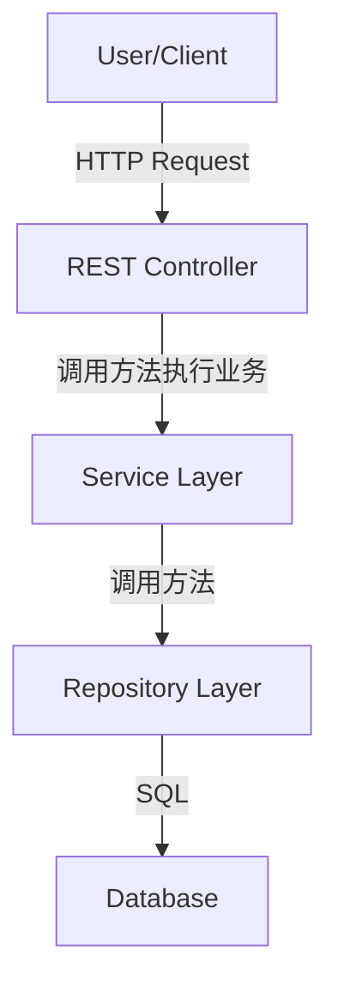
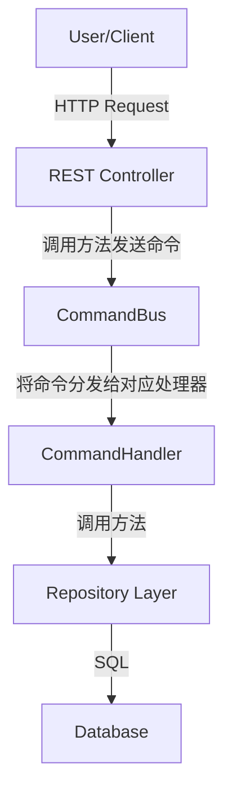
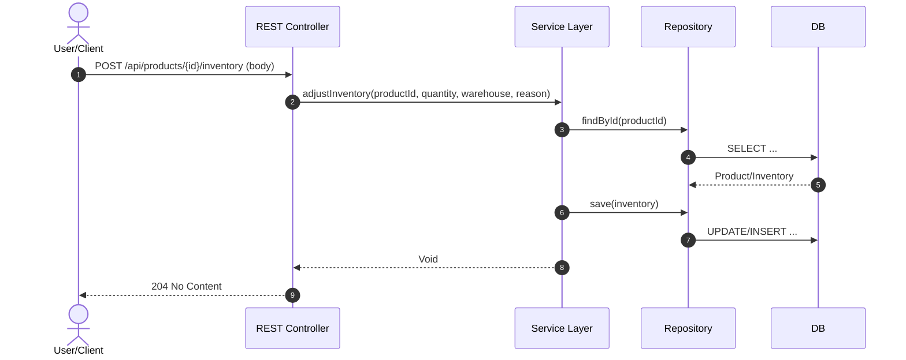
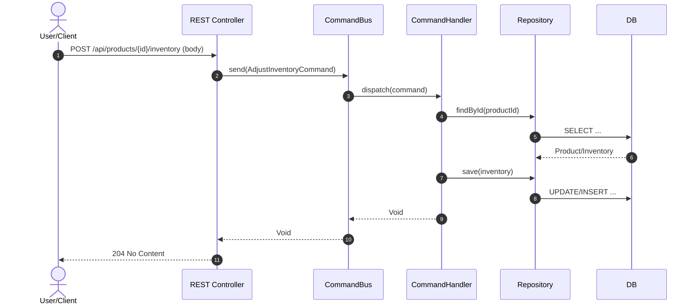
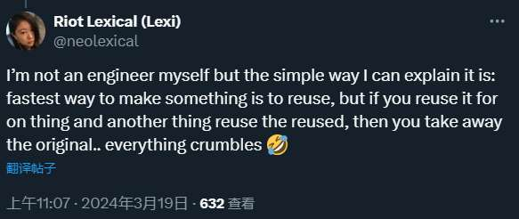
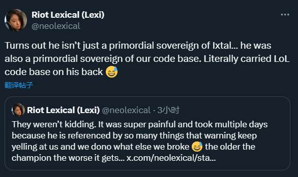
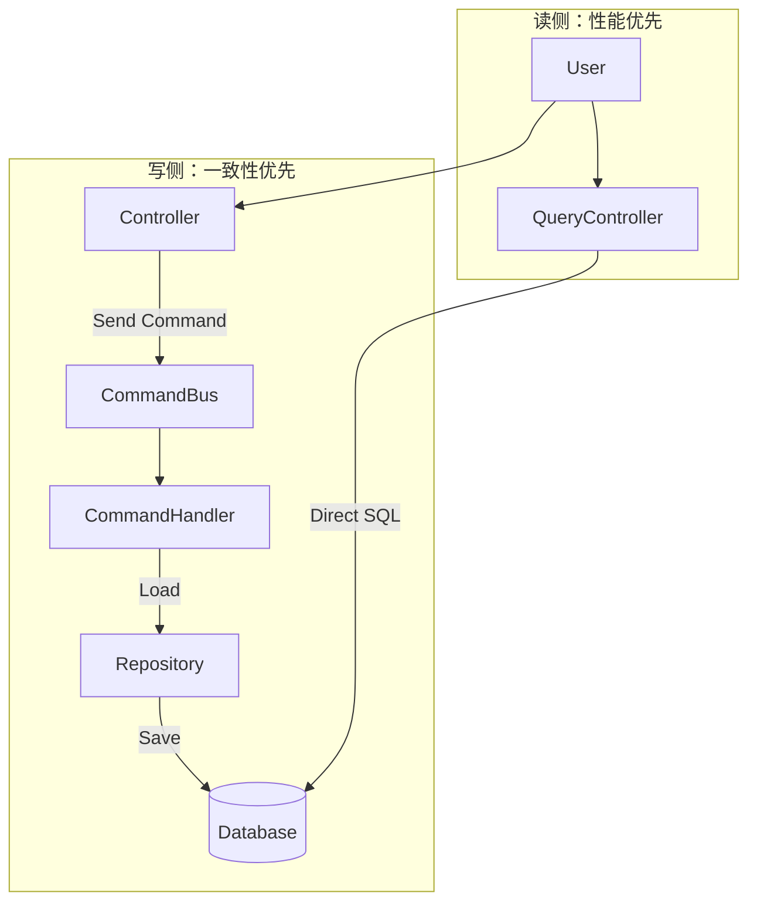

# 从 MVC 到 DDD：渐进式架构演进指南

<!-- TOC -->
- [从 MVC 到 DDD：渐进式架构演进指南](#从-mvc-到-ddd渐进式架构演进指南)
  - [适用人群](#适用人群)
  - [本文愿景](#本文愿景)
  - [技术栈说明](#技术栈说明)
  - [第一章：为什么需要改变 - MVC 的实际困境](#第一章为什么需要改变---mvc-的实际困境)
    - [1.1 一个典型的 MVC 项目](#11-一个典型的-mvc-项目)
    - [1.2 随着项目演进，问题逐渐显现](#12-随着项目演进问题逐渐显现)
      - [场景一：临时修改导致的混乱](#场景一临时修改导致的混乱)
      - [场景二：Service 层方法激增](#场景二service-层方法激增)
      - [场景三：职责不清的困境](#场景三职责不清的困境)
    - [1.3 更深层的问题：Controller 和 Service 的紧耦合](#13-更深层的问题controller-和-service-的紧耦合)
    - [1.4 查询操作 vs 命令操作：被忽视的差异](#14-查询操作-vs-命令操作被忽视的差异)
    - [1.5 小结：我们需要什么改变？](#15-小结我们需要什么改变)
  - [第二章：命令模式的引入 - 封装业务意图](#第二章命令模式的引入---封装业务意图)
    - [2.1 为什么需要命令模式？](#21-为什么需要命令模式)
    - [2.2 命令模式的基本概念](#22-命令模式的基本概念)
    - [2.3 第一步：定义命令对象](#23-第一步定义命令对象)
    - [2.4 第二步：定义命令处理器](#24-第二步定义命令处理器)
    - [2.5 第三步：重构 Controller](#25-第三步重构-controller)
    - [2.6 小结：我们获得了什么？](#26-小结我们获得了什么)
  - [第三章：中介者/命令总线 - 统一命令调度](#第三章中介者命令总线---统一命令调度)
    - [3.1 命令(Command) vs 事件(Event)](#31-命令command-vs-事件event)
    - [3.2 简单实现命令总线](#32-简单实现命令总线)
      - [3.2.1 第一步：定义强类型命令与处理器](#321-第一步定义强类型命令与处理器)
      - [3.2.2 第二步：实现强类型命令总线（单播、可返回值）](#322-第二步实现强类型命令总线单播可返回值)
      - [3.2.3 第三步：实现命令处理器（应用服务）](#323-第三步实现命令处理器应用服务)
    - [3.3 重构后的 Controller](#33-重构后的-controller)
    - [3.4 架构图发生的变化](#34-架构图发生的变化)
    - [3.5 实战：命令验证](#35-实战命令验证)
      - [3.5.1 在命令对象上声明约束](#351-在命令对象上声明约束)
      - [3.5.2 在 CommandBus 中调用 Validator](#352-在-commandbus-中调用-validator)
      - [3.5.3 异常到 HTTP 的映射](#353-异常到-http-的映射)
      - [3.5.4 装饰器/中间件式 CommandBus（可插拔）](#354-装饰器中间件式-commandbus可插拔)
      - [3.5.5 测试：独立验证命令](#355-测试独立验证命令)
    - [3.6 小结：命令模式把问题**全部**解决了吗？](#36-小结命令模式把问题全部解决了吗)
    - [3.7 显性成本 vs 隐性债务](#37-显性成本-vs-隐性债务)
      - [3.7.1 "填空题" vs "问答题"](#371-填空题-vs-问答题)
      - [3.7.2 看得见的文件 vs 看不见的耦合](#372-看得见的文件-vs-看不见的耦合)
    - [3.8 打破"复用"的执念](#38-打破复用的执念)
      - [3.8.1 所谓的"复用"往往是伪命题](#381-所谓的复用往往是伪命题)
      - [3.8.2 软件工程的复杂度治理](#382-软件工程的复杂度治理)
  - [第四章：CQRS - 读写职责分离](#第四章cqrs---读写职责分离)
    - [4.1 读写不对称的现实](#41-读写不对称的现实)
    - [4.2 什么是 CQRS？](#42-什么是-cqrs)
    - [4.3 演进：查询侧的重构](#43-演进查询侧的重构)
      - [4.3.1 第一步：定义查询对象（Query）](#431-第一步定义查询对象query)
      - [4.3.2 第二步：定义读模型（Read Model / DTO）](#432-第二步定义读模型read-model--dto)
      - [4.3.3 第三步：实现查询处理器（Query Handler）](#433-第三步实现查询处理器query-handler)
    - [4.4 为什么查询侧要“绕过”领域模型？](#44-为什么查询侧要绕过领域模型)
    - [4.5 架构图的再次演进](#45-架构图的再次演进)
    - [4.6 进阶：物理分离](#46-进阶物理分离)
    - [4.7 小结](#47-小结)
<!-- /TOC -->

## 适用人群

- 熟悉 Spring Boot 和 MVC 架构的 Java 开发者
- 对领域驱动设计（DDD）感兴趣，但不知从何入手
- 希望理解 DDD 项目结构和设计理念
- 想要改进现有 MVC 项目架构的开发者

## 本文愿景

完全的 MVC 和纯粹的 DDD 就像光谱的两端，从一端走向另一端的过程中，有诸多概念和设计决策可供选择。**没有架构是银弹**，只有最适合业务需求的架构才是最好的架构。

本文档最终希望画出一条坐标轴，以帮助开发者在 MVC 和 DDD 之间找到合适的平衡点，根据实际需求逐步引入 DDD 的核心理念和实践。

## 技术栈说明

- **MVC 基准**：Spring Boot 3.x
- **DDD 实践**：结合 Wow 框架（https://wow.ahoo.me/）
- **Java 版本**：Java 17+（使用 Record 等现代特性）

---

## 第一章：为什么需要改变 - MVC 的实际困境

### 1.1 一个典型的 MVC 项目

让我们从一个真实的 Spring Boot 项目开始。这是一个库存管理系统的典型代码：

**Controller 层：**

```java
@RestController
@RequestMapping("/api/products")
public class ProductController {

    private final ProductService productService;

    public ProductController(ProductService productService) {
        this.productService = productService;
    }

    /**
     * 调整产品库存
     */
    @PostMapping("/{productId}/inventory")
    public ResponseEntity<Void> adjustInventory(
            @PathVariable UUID productId,
            @RequestBody AdjustInventoryRequest body) {
        productService.adjustInventory(productId, body.quantity(), body.warehouse(), body.reason());
        return ResponseEntity.noContent().build();
    }
    
    /**
     * 获取产品详情
     */
    @GetMapping("/{productId}")
    public ResponseEntity<ProductDto> getProduct(
            @PathVariable UUID productId) {
        ProductDto product = productService.getProductById(productId);
        return ResponseEntity.ok(product);
    }
}
```

**Service 层：**

```java
@Service
public class ProductService {
    
    private final ProductRepository productRepository;
    private final InventoryRepository inventoryRepository;
    private final Clock clock;

    public ProductService(ProductRepository productRepository,
                          InventoryRepository inventoryRepository,
                          Clock clock) {
        this.productRepository = productRepository;
        this.inventoryRepository = inventoryRepository;
        this.clock = clock;
    }
    
    @Transactional
    public void adjustInventory(UUID productId, Integer quantity, 
                                String warehouse, String reason) {
        // 1. 查询产品
        Product product = productRepository.findById(productId)
            .orElseThrow(() -> new ProductNotFoundException(productId));
        
        // 2. 查询库存
        Inventory inventory = inventoryRepository
            .findByProductIdAndWarehouse(productId, warehouse)
            .orElseThrow(() -> new InventoryNotFoundException(productId, warehouse));
        
        // 3. 业务规则检查
        if (quantity < 0 && inventory.getQuantity() + quantity < 0) {
            throw new InsufficientStockException(
                "库存不足，当前: " + inventory.getQuantity() + ", 请求: " + quantity
            );
        }
        
        // 4. 更新库存
        inventory.setQuantity(inventory.getQuantity() + quantity);
        inventory.setLastModified(LocalDateTime.now(clock));
        inventoryRepository.save(inventory);
        
        // 5. 记录日志
        logInventoryChange(productId, warehouse, quantity, reason);
    }
    
    public ProductDto getProductById(UUID productId) {
        Product product = productRepository.findById(productId)
            .orElseThrow(() -> new ProductNotFoundException(productId));
        return ProductDto.from(product); // 统一返回 DTO
    }
    
    private void logInventoryChange(UUID productId, String warehouse, 
                                    Integer quantity, String reason) {
        // 日志记录逻辑（示例）
        LocalDateTime occurredAt = LocalDateTime.now(clock);
        // ...
    }
}
```

看起来还不错？分层清晰，职责明确。确实，对于简单的项目，这样的结构完全够用。

### 1.2 随着项目演进，问题逐渐显现

#### 场景一：临时修改导致的混乱

某天，产品经理提了个紧急需求："库存不足时，给采购部门发个通知"。时间紧迫，开发者直接在 Controller 里加了代码：

```java
@PostMapping("/{productId}/inventory")
public ResponseEntity<Void> adjustInventory(...) {
    // ❌ 在 Controller 中直接处理业务异常
    try {
        productService.adjustInventory(productId, quantity, warehouse, reason);
    } catch (InsufficientStockException e) {
        // 紧急加的需求：发送通知
        notificationService.sendStockAlert(productId);
        return ResponseEntity.status(HttpStatus.BAD_REQUEST).build();
    }
    return ResponseEntity.noContent().build();
}
```

又过了几天，另一个开发者在另一个 Controller 里也需要调整库存，他不知道第一个开发者的修改，直接调用了 Service：

```java
@PostMapping("/orders/{orderId}/confirm")
public ResponseEntity<Void> confirmOrder(...) {
    // ❌ 这里调整库存，但不会发送通知
    productService.adjustInventory(productId, quantity, warehouse, "订单确认");
    // ...
    return ResponseEntity.noContent().build();
}
```

**结果：** 同样的业务逻辑，在不同的地方有不同的实现，行为不一致。

#### 场景二：Service 层方法激增

随着业务发展，ProductService 里的方法越来越多：

```java
@Service
public class ProductService {
    // 库存相关
    public void adjustInventory(...) { }
    public void reserveInventory(...) { }
    public void releaseInventory(...) { }
    public void transferInventory(...) { }
    public void returnInventory(...) { }
    public void lockInventory(...) { }
    public void unlockInventory(...) { }
    
    // 产品相关
    public void createProduct(...) { }
    public void updateProduct(...) { }
    public void deleteProduct(...) { }
    public void updateProductPrice(...) { }
    public void updateProductCategory(...) { }
    
    // 查询相关
    public Product getProductById(...) { }
    public List<Product> getProductsByCategory(...) { }
    public List<Product> searchProducts(...) { }
    public PageResult<Product> getProductsPage(...) { }
    
    // ... 30+ 个方法
}
```

**问题：**
- 一个 Service 类几千行代码，难以维护
- 修改一个功能可能影响其他功能
- 新人接手项目时，不知道从哪看起

#### 场景三：职责不清的困境

作为团队 Leader，你在代码审查时看到新同事的代码：

```java
// 新同事的代码：在 Controller 里做参数校验
@PostMapping("/{productId}/inventory")
public ResponseEntity<Void> adjustInventory(...) {
    if (quantity == 0) {
        return ResponseEntity.badRequest().build();
    }
    // ...
    return ResponseEntity.noContent().build();
}
```

你说："参数校验应该在 Service 层做，Controller 只负责接收请求。"

新同事改了：

```java
// 新同事改后的代码：把校验移到 Service
@Service
public class ProductService {
    public void adjustInventory(...) {
        if (quantity == 0) {
            throw new IllegalArgumentException("调整数量不能为0");
        }
        // ...
    }
}
```

但另一个老员工说："参数校验应该用 Bean Validation 在入参时就做，不应该进 Service。"

第三个同事说："简单的参数校验可以在 Controller，复杂的业务规则校验应该在 Service。"

**结果：** 团队内部对职责划分没有共识，每个人的写法都不一样。

### 1.3 更深层的问题：Controller 和 Service 的紧耦合

回到最初的代码：

```java
@RestController
@RequestMapping("/api/products")
public class ProductController {
    @Autowired
    private ProductService productService;
    
    @PostMapping("/{productId}/inventory")
    public ResponseEntity<Void> adjustInventory(...) {
        productService.adjustInventory(productId, quantity, warehouse, reason);
        return ResponseEntity.noContent().build();
    }
}
```

这段代码有什么问题？

**问题 1：Controller 直接依赖具体的 Service 类**
- 测试 Controller 时必须准备好 ProductService
- ProductService 的任何修改都可能影响 Controller
- 增加新的业务场景需要修改 Service 接口

**问题 2：参数传递繁琐**
- 方法参数越来越多（实际项目中经常有 7-8 个参数）
- 增加参数需要修改接口定义和所有调用方
- 参数顺序容易搞错，尤其是多个相同类型的参数

**问题 3：无法统一处理横切关注点**

假设你想给所有"修改操作"加上操作日志，记录"谁在什么时候做了什么"：

```java
@PostMapping("/{productId}/inventory")
public ResponseEntity<Void> adjustInventory(...) {
    // ❌ 每个方法都要加日志
    operationLogger.log("调整库存", getCurrentUser(), productId, quantity);
    productService.adjustInventory(productId, quantity, warehouse, reason);
    return ResponseEntity.noContent().build();
}

@PostMapping
public ResponseEntity<Void> createProduct(...) {
    // ❌ 重复的日志代码
    operationLogger.log("创建产品", getCurrentUser(), productName);
    productService.createProduct(name, category, price);
    return ResponseEntity.noContent().build();
}
```

如果有 50 个这样的接口，你要写 50 次日志代码。

### 1.4 查询操作 vs 命令操作：被忽视的差异

仔细观察我们的 Service 层：

```java
// 查询操作：只读，不修改状态
public Product getProductById(String productId) {
    return productRepository.findById(productId).orElseThrow();
}

// 命令操作：修改状态
public void adjustInventory(String productId, Integer quantity, ...) {
    // 复杂的业务逻辑
    // 修改数据
    // 记录日志
}
```

这两种操作的特点完全不同：

| 特点 | 查询操作 | 命令操作 |
|------|----------|----------|
| **是否修改状态** | 否 | 是 |
| **业务复杂度** | 简单，通常就是从数据库取数据 | 复杂，包含业务规则、校验、副作用 |
| **性能优化** | 可以缓存、只读副本、异步加载 | 需要事务、一致性保证 |
| **测试难度** | 低，只需验证返回值 | 高，需要验证状态变更、副作用 |
| **错误处理** | 通常只有"找不到"这种错误 | 各种业务规则违反的错误 |

但在传统 MVC 中，它们被同等对待，都是 Service 层的一个方法。

### 1.5 小结：我们需要什么改变？

通过以上场景，我们发现传统 MVC 架构在项目演进过程中的问题：

1. **无法阻止不良实践**：架构上没有约束，容易在 Controller 里写业务逻辑
2. **紧耦合**：Controller 直接依赖 Service，一旦修改，影响面大
3. **横切关注点难以统一处理**：日志、权限、监控等需要重复编写
4. **查询和命令混为一谈**：没有区分读写操作的不同特点

**好消息是**：我们不需要一次性推翻重来，可以通过渐进式的改进逐步解决这些问题。

**下一章**，我们将引入**命令模式**，通过最小的改动，解决参数传递和职责不清的问题

---

## 第二章：命令模式的引入 - 封装业务意图

### 2.1 为什么需要命令模式？

回顾第一章的 Controller 代码：

```java
productService.adjustInventory(productId, quantity, warehouse, reason);
```

这种调用方式有什么问题？

1. **参数列表冗长**：方法参数越来越多（实际项目中经常有 7-8 个参数），一来产生传参时的顺序问题，二来增加参数需要修改接口定义和所有调用方。在某些对代码质量要求非常高的团队，参数列表甚至会要求不超过 2 个，只有在极端情况下才允许 3 个参数以确保杜绝顺序问题。虽然使用命名参数（productId=..., quantity=...）也可以解决顺序问题，但同时命名参数使得代码变得冗长，而且解决不了修改参数时需要牵扯所有调用方的问题（而且java 还没有原生支持命名参数）。因此，我们通常采用参数包的方式来解决这个问题，即将多个参数封装到一个对象中传递。
2. **难以追踪**：无法记录"谁在什么时候发起了这个操作"。在现代应用中，审计日志和操作日志是非常重要的需求，但如果Controller是使用调用函数的方式去执行业务逻辑，那要么开发者愿意在每个业务逻辑的调用点手动添加日志代码，要么用更重量级的拦截器等方案实现日志记录。各种在这方面找补的方案都有哪些弊端此处不再赘述，但我们应该意识到像日志这样的重点需求，应该在架构层面予以支持，依赖开发者自觉或后期打补丁的方式都只能证明架构设计在一开始的设计不周。理想情况下，我们希望有一种自动化日志记录的机制，能够在不修改业务代码的情况下，统一记录所有的业务操作。而且，为了保证日志的逻辑一致性，这些日志的记录时机应该是一致的：比如在收到请求时，统一记录请求的元信息（用户、时间、请求参数等）；再比如在执行业务逻辑时，统一记录操作的元信息（操作类型、参数等）。这就是AOP所说的"横切关注点"。更加显而易见的是，横切关注点最好能正好卡在架构的分层边界上以避免产生任何侵入性：如果Controller负责接收请求，Service负责执行业务逻辑，那么操作的日志记录就应该发生在Controller和Service之间，就像是我们在中间插入了一层中间层。这层中间层在代码里是不存在的，但在架构设计上是明确的。因此，为了支持这样的架构设计，接口层必须和业务逻辑层完全解耦，在代码上不产生任何依赖关系，从而在架构上形成两个层之间明确的边界。但当两个层完全解耦之后，接口层就无法直接调用业务逻辑层的方法了，这时我们需要一种新的方式来执行业务逻辑，即**命令模式**。

### 2.2 命令模式的基本概念

从类比的角度来看，前端通过http请求调用后端接口，这个过程本质上就是一种"命令"的发送和执行过程。http请求无非是一个内容复杂的参数包，后端接口层拿到这个参数包后，将其转换为后端需要实际处理的数据。正是由于这种"命令"的概念，前后端分离架构才能得以实现。因此，我们可以说使用命令模式来解耦层与层之间的调用关系是已经实际使用了几十年的成熟架构设计。

前端和后端可以用命令模式分离，接口层和业务逻辑层同样可以用命令模式分离。而我们要做的有三件事：定义如同“http请求”一样的命令对象，定义“业务层的controller”来处理命令对象（显而易见，既然这个controller是用来处理命令的，它应该有一个新名字，我们叫它CommandController，命令处理器），最后重构接口层把函数调用改成发送“命令”。

### 2.3 第一步：定义命令对象

```java
/**
 * 调整库存命令
 * 使用 Java Record 确保不可变性
 * 
 * 命令对象是纯粹的数据容器，不包含任何业务逻辑
 */
public record AdjustInventoryCommand(
    UUID productId,
    Integer quantity,
    String warehouse,
    String reason
) {
    // Record 自动生成构造器、getter、equals、hashCode、toString
    // 命令内部不应该有任何方法或业务逻辑
}
```

**为什么使用 Record？**
- **不可变（Immutable）**：命令一旦创建就不应该被修改
- **简洁**：自动生成构造器、getter、equals、hashCode、toString 等样板代码
- **值语义**：基于内容的 equals 和 hashCode，方便比较和存储

**命令对象的设计原则：**
- ✅ 只包含数据字段，其他什么都不包含，作为纯粹的参数包，承载业务意图
- ✅ 所有字段都是 final 的（Record 默认就是）

这里，我们定义了一个 `AdjustInventoryCommand`，但实际项目中的命令设计会远比这复杂得多。就像http请求由各种方法（GET/POST/PUT/DELETE）、路径、查询参数、请求体等组成一样，命令对象也会根据业务需求包含各种字段和嵌套结构，显而易见的就是所有命令都需要携带“发起人”“时间戳”等元信息以支持审计日志等需求，有用户系统的项目还需要携带“用户ID”“权限信息”等等。这些非常通用的字段一般是直接写在架构里作为ICommand接口的默认字段，让其他命令继承即可。等到后期章节我们细看Wow框架时，会看到Wow为命令准备的海量元信息字段。

### 2.4 第二步：定义命令处理器

```java
/**
 * 调整库存命令处理器
 * 负责执行命令的业务逻辑
 */
@Component
public class AdjustInventoryCommandHandler {
    
    private final ProductRepository productRepository;
    private final InventoryRepository inventoryRepository;
    private final InventoryLogRepository inventoryLogRepository;
    private final Clock clock;

    public AdjustInventoryCommandHandler(ProductRepository productRepository,
                                         InventoryRepository inventoryRepository,
                                         InventoryLogRepository inventoryLogRepository,
                                         Clock clock) {
        this.productRepository = productRepository;
        this.inventoryRepository = inventoryRepository;
        this.inventoryLogRepository = inventoryLogRepository;
        this.clock = clock;
    }
    
    /**
     * 处理命令
     */
    @Transactional
    public void handle(AdjustInventoryCommand command) {
        // 1. 验证产品存在
        Product product = productRepository.findById(command.productId())
            .orElseThrow(() -> new ProductNotFoundException(command.productId()));
        
        // 2. 获取或创建库存记录
        Inventory inventory = inventoryRepository
            .findByProductIdAndWarehouse(command.productId(), command.warehouse())
            .orElseGet(() -> createNewInventory(command.productId(), command.warehouse()));
        
        // 3. 执行业务逻辑
        int newQuantity = inventory.getQuantity() + command.quantity();
        if (newQuantity < 0) {
            throw new InsufficientStockException(
                String.format("库存不足。产品: %s, 仓库: %s, 当前: %d, 请求: %d",
                    command.productId(), command.warehouse(), 
                    inventory.getQuantity(), command.quantity())
            );
        }

        inventory.setQuantity(newQuantity);
        inventory.setLastModified(LocalDateTime.now(clock));
        inventoryRepository.save(inventory);
        
        // 4. 记录操作日志
        InventoryLog log = new InventoryLog(
            UUID.randomUUID(),
            command.productId(),
            command.warehouse(),
            command.quantity(),
            newQuantity,
            command.reason(),
            LocalDateTime.now(clock)
        );
        inventoryLogRepository.save(log);
    }
    
    private Inventory createNewInventory(UUID productId, String warehouse) {
        Inventory inventory = new Inventory();
        inventory.setId(UUID.randomUUID());
        inventory.setProductId(productId);
        inventory.setWarehouse(warehouse);
        inventory.setQuantity(0);
        inventory.setCreatedAt(LocalDateTime.now(clock));
        return inventory;
    }
}
```

### 2.5 第三步：重构 Controller

```java
public record AdjustInventoryRequest(
    Integer quantity,
    String warehouse,
    String reason
) {}

@RestController
@RequestMapping("/api/products")
public class ProductController {

    private final AdjustInventoryCommandHandler commandHandler;

    public ProductController(AdjustInventoryCommandHandler commandHandler) {
        this.commandHandler = commandHandler;
    }

    @PostMapping("/{productId}/inventory")
    public ResponseEntity<Void> adjustInventory(
        @PathVariable UUID productId,
        @RequestBody AdjustInventoryRequest body) {
        
        // 从函数调用变成命令发送
        AdjustInventoryCommand command = new AdjustInventoryCommand(
            productId, body.quantity(), body.warehouse(), body.reason()
        );

        // 执行命令
        commandHandler.handle(command);

        // 成功且无返回资源，使用 204
        return ResponseEntity.noContent().build();
    }
}
```

### 2.6 小结：我们获得了什么？

对比重构前后：

| 方面 | 重构前 | 重构后 |
|------|--------|--------|
| **业务意图** | 方法调用 | 命令对象 |
| **参数传递** | 多个参数 | 单个命令对象 |
| **可测试性** | 需要 Mock Service | 直接测试 CommandHandler |
| **可追踪性** | 难以记录操作历史 | 通过审计日志记录历史 |
| **扩展性** | 修改方法签名影响所有调用方 | 在命令中添加字段，向后兼容 |

到这里，我们已经初步实现了命令模式的引入，但眼下的代码显然没有达成我们预期的解耦效果：因为我们有一件事还没有做，那就是**统一的命令调度器**，也就是所谓的**命令总线（Command Bus）**。当前端往后端发送请求时，http请求是整个互联网的基础设施帮我们调度的，而在后端，命令如何从Controller传递到CommandHandler，需要我们自己提供调度器来完成。如果业务需求对命令调度的关注度不高，我们可以把命令总线写的比较简单，并内嵌在框架里；但如果业务对命令调度有较高的要求，比如我希望在监控系统里可视化的看到每个命令的执行情况，或者由于业务特殊，当命令出现问题（比如库存不足）时，运维人员可以直接在后台系统里重新调度命令（而不是让用户重新发起请求），那么我们就需要一个功能更强大的命令总线，这时候由于命令总线本身承担了大量业务职责，我们可以单独写一套命令总线系统，作为某种基础设施服务来使用。当然，后者的实现对于本文档来说过于复杂，我们在接下来只用一个简单的命令总线来说明问题。

---

## 第三章：中介者/命令总线 - 统一命令调度

你知道吗，笔者完全不愿意写这一章，因为.net程序员有 MediatR 可用……

但由于本文档的背景是java，只好自己动手实现一个简单的命令总线（Command Bus），用于说明其存在的必要性。

### 3.1 命令(Command) vs 事件(Event)

熟悉事件驱动架构的读者可能会问，为什么不直接用 Spring 的 ApplicationEvent 来做命令调度呢？毕竟 Spring ApplicationEvent 本质上也是一种发布-订阅（Pub/Sub）模式的实现，完全可以用来传递命令对象。

**答案：**
1. **单播 vs 多播**：命令是单播的，意味着每个命令只会被一个处理器处理；而事件是多播的，可能会被多个监听器处理。
2. **返回值**：命令通常需要返回处理结果或错误信息，而事件则不需要关注返回值。
3. **处理顺序**：命令的处理顺序是确定的，而事件的处理顺序可能会受到并发和异步的影响。

从根本上来说，“命令”所表达的是“意图”，当一个命令被new出来时，它代表着“我要做某事”，这件事**必须**被处理器处理并返回结果；而“事件”所表达的是“事实”，当一个事件被发布时，它代表着“某事已经发生了”，这件事可能会被多个监听器关注和处理，但不要求任何监听器必须处理它。

命令和事件的日志记录也各有用处，当开发者拿到命令日志时，可以清晰地看到“谁在什么时候发起了什么操作”，从而追踪用户行为；而事件日志则可以帮助开发者了解系统内部发生了什么变化，便于调试和监控，在后期章节我们还能看到Wow框架的事件溯源机制，看看当我们把事件驱动架构用到极致时，会发生什么有趣的事情。

### 3.2 简单实现命令总线

本章不想看可以跳过，就算看了也意义不大，因为全是大模型生成的代码，完全是因为必须有这一章，才有的这一章。一个“进程内、同步、单播”的中介者已经足以用来说明问题。

#### 3.2.1 第一步：定义强类型命令与处理器

```java
/** 命令：带返回值类型参数 R */
public interface Command<R> {}

/** 处理器：每种命令唯一处理器（类型由泛型 C 推断，无需手写 supports） */
public interface CommandHandler<C extends Command<R>, R> {
    R handle(C command);
}

/** 示例命令与返回值 */
public record AdjustInventoryCommand(UUID productId, Integer quantity, String warehouse, String reason)
        implements Command<Void> {}
```

#### 3.2.2 第二步：实现强类型命令总线（单播、可返回值）

```java
import org.springframework.core.ResolvableType;

@Component
public class CommandBus {
    private final Map<Class<?>, CommandHandler<?, ?>> registry;

    public CommandBus(List<CommandHandler<?, ?>> handlers) {
        Map<Class<?>, CommandHandler<?, ?>> map = new HashMap<>();
        for (CommandHandler<?, ?> h : handlers) {
            Class<?> cmdType = ResolvableType
                .forClass(CommandHandler.class, h.getClass())
                .resolveGeneric(0); // 解析 C 的实际类型
            if (cmdType == null) {
                throw new IllegalStateException("无法解析命令类型: " + h.getClass());
            }
            if (map.putIfAbsent(cmdType, h) != null) {
                throw new IllegalStateException("命令处理器重复: " + cmdType.getName());
            }
        }
        this.registry = Map.copyOf(map); // 不可变映射
    }

    @SuppressWarnings("unchecked")
    public <R, C extends Command<R>> R send(C command) {
        CommandHandler<C, R> handler = (CommandHandler<C, R>) registry.get(command.getClass());
        if (handler == null) {
            throw new IllegalStateException("未找到命令处理器: " + command.getClass().getSimpleName());
        }
        return handler.handle(command);
    }
}
```

#### 3.2.3 第三步：实现命令处理器（应用服务）

```java
@Component
public class AdjustInventoryCommandHandler implements CommandHandler<AdjustInventoryCommand, Void> {
    private final ProductRepository productRepository;
    private final InventoryRepository inventoryRepository;
    private final InventoryLogRepository inventoryLogRepository;
    private final Clock clock;

    public AdjustInventoryCommandHandler(ProductRepository productRepository,
                                         InventoryRepository inventoryRepository,
                                         InventoryLogRepository inventoryLogRepository,
                                         Clock clock) {
        this.productRepository = productRepository;
        this.inventoryRepository = inventoryRepository;
        this.inventoryLogRepository = inventoryLogRepository;
        this.clock = clock;
    }

    @Override
    @Transactional
    public Void handle(AdjustInventoryCommand command) {
        Product product = productRepository.findById(command.productId())
            .orElseThrow(() -> new ProductNotFoundException(command.productId()));

        Inventory inventory = inventoryRepository
            .findByProductIdAndWarehouse(command.productId(), command.warehouse())
            .orElseGet(() -> createNewInventory(command.productId(), command.warehouse()));

        int newQuantity = inventory.getQuantity() + command.quantity();
        if (newQuantity < 0) {
            throw new InsufficientStockException(
                String.format("库存不足。当前: %d, 请求: %d", inventory.getQuantity(), command.quantity()));
        }

        inventory.setQuantity(newQuantity);
        inventory.setLastModified(LocalDateTime.now(clock));
        inventoryRepository.save(inventory);

        InventoryLog log = new InventoryLog(
            UUID.randomUUID(),
            command.productId(),
            command.warehouse(),
            command.quantity(),
            newQuantity,
            command.reason(),
            LocalDateTime.now(clock)
        );
        inventoryLogRepository.save(log);
        return null;
    }

    private Inventory createNewInventory(UUID productId, String warehouse) {
        Inventory inventory = new Inventory();
        inventory.setId(UUID.randomUUID());
        inventory.setProductId(productId);
        inventory.setWarehouse(warehouse);
        inventory.setQuantity(0);
        inventory.setCreatedAt(LocalDateTime.now(clock));
        return inventory;
    }
}
```

### 3.3 重构后的 Controller

现在，所有的接口都只有一个依赖：CommandBus。都只做一个简单操作：把请求转换成命令并发送出去。

```java
@RestController
@RequestMapping("/api/products")
public class ProductController {

    private final CommandBus commandBus;

    public ProductController(CommandBus commandBus) {
        this.commandBus = commandBus;
    }

    // 命令操作：通过 CommandBus（PathVariable + RequestBody）
    @PostMapping("/{productId}/inventory")
    public ResponseEntity<Void> adjustInventory(@PathVariable UUID productId,
                                                @RequestBody AdjustInventoryRequest body) {
        commandBus.send(new AdjustInventoryCommand(productId, body.quantity(), body.warehouse(), body.reason()));
        return ResponseEntity.noContent().build();
    }
}
```

### 3.4 架构图发生的变化

在第一章开始之前，传统MVC架构大致是这样子的：



而到3.3节重构完成后，一个简单的命令总线被引入，架构图变成了这样：



从时序图的角度来看，在MVC架构中时序图大致是这样的：



而到3.3节重构完成后，时序图变成了这样：



CommandBus 的引入，给我们提供了一个可以大展身手的切面，我们可以在 CommandBus 里实现各种横切关注点的处理，比如验证、日志、权限等，而不需要侵入业务代码。接下来，我们就在CommandBus里实际开发一下命令验证功能。

### 3.5 实战：命令验证

本节用 jakarta.validation.Validator（Bean Validation）来实现命令验证。

#### 3.5.1 在命令对象上声明约束

直接在 record 组件上标注约束即可。

```java
import jakarta.validation.constraints.*;

/**
 * 调整库存命令（示例）
 * - 允许 quantity 为正（入库）或负（出库），但不允许为 0
 */
public record AdjustInventoryCommand(
    @NotNull(message = "产品ID必填")
    UUID productId,

    @NotNull(message = "调整数量必填")
    @NonZero // 自定义约束，示例见下
    Integer quantity,

    @NotBlank(message = "仓库编码必填")
    @Size(max = 32, message = "仓库编码过长")
    String warehouse,

    @Size(max = 256, message = "原因过长")
    String reason
) implements Command<Void> {}
```

自定义一个“非零”约束：

```java
import jakarta.validation.Constraint;
import jakarta.validation.Payload;
import java.lang.annotation.*;

@Documented
@Constraint(validatedBy = NonZeroValidator.class)
@Target({ ElementType.FIELD, ElementType.RECORD_COMPONENT, ElementType.PARAMETER })
@Retention(RetentionPolicy.RUNTIME)
public @interface NonZero {
    String message() default "值不能为0";
    Class<?>[] groups() default {};
    Class<? extends Payload>[] payload() default {};
}

import jakarta.validation.ConstraintValidator;
import jakarta.validation.ConstraintValidatorContext;

public class NonZeroValidator implements ConstraintValidator<NonZero, Number> {
    @Override
    public boolean isValid(Number value, ConstraintValidatorContext context) {
        return value == null || value.longValue() != 0L;
    }
}
```

#### 3.5.2 在 CommandBus 中调用 Validator

在前文的 `CommandBus` 中加入 Validator，`send` 时先做校验：

```java
import org.springframework.core.ResolvableType;

@Component
public class CommandBus {
    private final Map<Class<?>, CommandHandler<?, ?>> registry;
    private final jakarta.validation.Validator validator;

    public CommandBus(List<CommandHandler<?, ?>> handlers,
                      jakarta.validation.Validator validator) {
        this.validator = validator;
        Map<Class<?>, CommandHandler<?, ?>> map = new HashMap<>();
        for (CommandHandler<?, ?> h : handlers) {
            Class<?> cmdType = ResolvableType
                .forClass(CommandHandler.class, h.getClass())
                .resolveGeneric(0);
            if (cmdType == null) {
                throw new IllegalStateException("无法解析命令类型: " + h.getClass());
            }
            if (map.putIfAbsent(cmdType, h) != null) {
                throw new IllegalStateException("命令处理器重复: " + cmdType.getName());
            }
        }
        this.registry = Map.copyOf(map);
    }

    @SuppressWarnings("unchecked")
    public <R, C extends Command<R>> R send(C command) {
        // 1) Bean Validation
        Set<ConstraintViolation<C>> violations = validator.validate(command);
        if (!violations.isEmpty()) {
            throw new ConstraintViolationException(violations);
        }

        // 2) 分发
        CommandHandler<C, R> handler = (CommandHandler<C, R>) registry.get(command.getClass());
        if (handler == null) {
            throw new IllegalStateException("未找到命令处理器: " + command.getClass().getSimpleName());
        }
        return handler.handle(command);
    }
}
```

这样即可保证“任何通过 CommandBus 发送的命令”都先被自动校验，违规时抛出 `ConstraintViolationException`。

#### 3.5.3 异常到 HTTP 的映射

为了让前端收到友好的 400 响应，可在接口层统一拦截 `ConstraintViolationException`：

```java
@RestControllerAdvice
public class ValidationExceptionHandler {
    @ExceptionHandler(ConstraintViolationException.class)
    @ResponseStatus(HttpStatus.BAD_REQUEST)
    public Map<String, Object> handle(ConstraintViolationException ex) {
        List<Map<String, String>> errors = ex.getConstraintViolations().stream()
            .map(v -> Map.of(
                "field", v.getPropertyPath().toString(),
                "message", v.getMessage()
            ))
            .toList();
        return Map.of("code", "VALIDATION_ERROR", "errors", errors);
    }
}
```

如果你的 Controller 入参已经使用 `@Valid` 做了一轮校验，保持“轻校验在 Controller、规则校验在命令对象”也未尝不可；但将“命令的语义约束”归并在命令本体更清晰，也能覆盖“非 HTTP 场景（消息、批处理）”。

#### 3.5.4 装饰器/中间件式 CommandBus（可插拔）

若不想修改现有 `CommandBus` 实现，可以用装饰器把验证作为一个中间层：

```java
public interface ICommandBus {
    <R, C extends Command<R>> R send(C command);
}

@Component("simpleCommandBus")
public class SimpleCommandBus implements ICommandBus { /* 采用 3.2.2 的反射注册实现 */ }

@Primary
@Component
public class ValidatingCommandBus implements ICommandBus {
    private final ICommandBus next;
    private final jakarta.validation.Validator validator;

    public ValidatingCommandBus(@Qualifier("simpleCommandBus") @Lazy ICommandBus next,
                                jakarta.validation.Validator validator) {
        this.next = next;
        this.validator = validator;
    }

    @Override
    public <R, C extends Command<R>> R send(C command) {
        Set<ConstraintViolation<C>> violations = validator.validate(command);
        if (!violations.isEmpty()) throw new ConstraintViolationException(violations);
        return next.send(command);
    }
}
```

这种方式便于继续叠加更多中间件，例如 `AuthorizingCommandBus`、`LoggingCommandBus`，形成责任链。

#### 3.5.5 测试：独立验证命令

```java
@Test
void adjustInventoryCommand_should_fail_when_quantity_is_zero() {
    Validator validator = Validation.buildDefaultValidatorFactory().getValidator();
    AdjustInventoryCommand cmd = new AdjustInventoryCommand(UUID.randomUUID(), 0, "WH-01", "test");
    Set<ConstraintViolation<AdjustInventoryCommand>> v = validator.validate(cmd);
    assertFalse(v.isEmpty());
}
```

至此，我们已经把“命令验证”功能完整实现了。

### 3.6 小结：命令模式把问题**全部**解决了吗？

在小结之前，笔者想先申明一项观点：推动开发者们开始反对传统 MVC 架构，研究 DDD 的驱动力是什么？如果列举一个评测表格，DDD 不见得在各种场景下都优于 MVC 架构，甚至我们完全可以下一个论断：在这世界上绝大多数的中小型项目中，MVC 架构远比 DDD 架构更合适。真正在推动 DDD 兴起的动力，是**大型**乃至**超大型**项目的开发需求，这些项目有着极其复杂的业务逻辑和庞大的代码基数，没有任何开发者可以做到以一己之力对整个项目的业务逻辑了如指掌，为此必须通过架构设计**降低开发者的心智负担**，能交给架构解决的问题，就绝不让开发者去解决。

命令模式的引入解决了我们在第一章看到的诸多问题，如果说哪个问题的解决是最具价值的，笔者认为是“阻止开发者在 Controller 里写业务逻辑”这一点。优秀的架构设计，应该能让开发者自然而然地遵守架构规则，而不是靠代码审查和团队规范来强制执行，如果一件事不应该被做，那么架构设计就应该让这件事变得“不可能”去做。命令模式的引入，彻底切断了 Controller 和业务逻辑层的直接依赖关系，开发者在 Controller 里根本无法调用业务逻辑代码，从而杜绝了在 Controller 里写业务逻辑的可能性。

但当我们一一对照第一章列出的问题清单时，会发现仍有一项问题没有解决：查询操作和命令操作的区别。我们当然可以写一些查询命令和相应的命令处理器，然后再把查询结果发回给 Controller，这种方式当然简单、清晰、具有逻辑一致性，对于简单项目非常合理。但在真实业务中，我们是可以预见我们需要处理什么状况的：随着用户的增多，数据量的增大，性能问题会逐渐显现出来，查询操作的性能优化需求会越来越多，最终我们会发现查询操作和命令操作的优化方式完全不同，查询操作需要缓存、只读副本、异步加载等技术，而命令操作则需要事务、一致性保证等技术。到那时，为了分别对查询和命令进行优化，我们最好将查询操作和命令操作彻底分离开来，形成 CQRS（Command Query Responsibility Segregation，命令查询职责分离）——因为这个时候，在查询和命令混杂在一起的情况下做优化所导致的复杂性，已经远远超过了使用 CQRS 所带来的复杂性。

然而“积重难返”这件事并不只是说说而已，当一个项目已经使用传统 MVC 架构开发了多年，代码基数已经非常庞大时，贸然引入 CQRS 只会带来更大的混乱，当业务尚未停滞时，开发者根本没有时间和精力去重构整个项目的架构。因此，要在项目中引入 CQRS，最好的时间点只有一个：立项之初。而这时，架构师要向团队解释的问题，就变成了为什么要在业务尚不复杂时引入CQRS，导致架构复杂性的增加。而答案是清晰明确的：**应对未来的复杂性**。

本文无意详解 CQRS，很多文档教程已经对 CQRS 有非常详尽的介绍，比如[ Microsoft Azure Global Edition 技术文档-云设计模式-CQRS](https://learn.microsoft.com/zh-cn/azure/architecture/patterns/cqrs)，笔者只希望说明一点：相比其他的设计模式，CQRS 在从 MVC 到 DDD 架构的过程中优先级非常高，高到甚至应该代替命令模式，成为本文的前三章的内容。但在引入命令模式之前改用 CQRS，在代码上并不会产生太大的差异，这会导致读者对CQRS产生错误的“意义不大”的第一印象，因此本文选择了先引入命令模式，再引入 CQRS。

### 3.7 显性成本 vs 隐性债务

很多开发者在初次接触命令模式时，最直观的感受是："原来我只需要在 Service 里写一个方法，现在我得定义一个 Command 类，再写一个 Handler 类，还要去注册。明明几行代码就能搞定的事，为什么要搞得这么复杂？这不是增加工作量吗？"

这是一个非常典型且合理的质疑。从**代码行数**和**文件数量**的维度来看，命令模式确实增加了"物理负担"。但从**软件工程**和**认知负荷**的维度来看，结论恰恰相反。

#### 3.7.1 "填空题" vs "问答题"

在传统 MVC Service 中，当你接到一个新需求时，你面临的是一道**问答题**：
- "这个逻辑应该加在哪个 Service 里？"
- "是加新方法，还是修改旧方法？"
- "这个旧方法被其他地方调用了吗？我改了会不会炸？"
- "这个 Service 已经 3000 行了，我再加 50 行会不会被骂？"

而在命令模式下，你面临的是一道**填空题**：
- 第一步：定义意图（新建 `XxxCommand`）
- 第二步：实现逻辑（新建 `XxxCommandHandler`）
- 结束。

你不需要关心这段代码放在哪里，因为它有且只有一个位置：它自己的 Handler 里。你不需要担心影响其他功能，因为没有其他功能会依赖你的 Handler。这种**确定性**极大地降低了编写代码时的心理压力。

#### 3.7.2 看得见的文件 vs 看不见的耦合

多写两个类文件，是**显性成本**，你看得见，摸得着，所以你会抱怨。

但 Service 模式带来的**隐性债务**往往被忽视：
- 为了复用而产生的各种 `if (flag)` 判断；
- 动辄几十个参数的方法签名；
- 难以理清的依赖关系网；
- 新人入职时面对 5000 行 Service 类的恐惧。

命令模式通过增加一点点显性的"打字成本"，消除了巨大的隐性维护成本。对于长期维护的项目来说，这是一笔非常划算的交易。

### 3.8 打破"复用"的执念

#### 3.8.1 所谓的"复用"往往是伪命题

当我们为每一个命令都创建一个对应的命令处理器时，就会有人反驳说："Service 方法可以复用啊！"。但请仔细回想，你的业务逻辑真的有那么多完全一样的复用场景吗？

- "用户注册"和"管理员创建用户"，看起来都是"插入用户表"，但前者需要发激活邮件，后者需要记录审计日志。
- "修改密码"和"重置密码"，前者需要校验旧密码，后者需要校验短信验证码。

强行复用往往导致 Service 方法变成这样：
```java
public void updateUser(User user, boolean isAdmin, boolean sendEmail, boolean checkOldPassword) { ... }
```
这才是真正的心智负担。命令模式承认业务场景的**独特性**，每个 Use Case（用例）都有独立的 Handler。如果真有公共逻辑（比如密码加密），应该提取为纯函数，而不是通过复用 Service 方法来耦合业务流程。

笔者必须在这里下一个惊悚而强悍的论断：**业务代码复用是反模式**！长期以来，业务代码应该复用这一观念在业界根深蒂固，但时至今日，层出不穷的事故已经向我们证明，曾经被大家追捧的代码复用已经成为了一个**十亿美元的错误**！

大家不会对那些知名的事故感到陌生，就像英雄联盟这款游戏在2024年的一次更新一样，一个给“英雄”设计的“技能”的代码在不断的复用中，最终成为了整个代码库的基石，一旦稍加改动，则牵一发而动全身：

 


很遗憾，这个案例把曾经编写这部分代码的开发者们钉在了耻辱柱上，但这并不完全是他们的过错。软件开发是个非常年轻而幼稚的行业，几乎没什么金科玉律能在行业还在爆炸式发展的时代沉淀下来。我们都曾犯过骇人的错误，但重要的是保持学习与思考，永远前进在改进的路上。

曾经的开发者们喜欢复用，是因为他们讨厌“冗余”。这是个“离天才太近，离人间太远”的观念。现实世界并不像计算机，当车流量超出预期时马路不能自动变宽，堵车了就需要人为疏通不能放着不管；而程序可以随时申请更多内存，内存不够了大不了就停止运行，在三十年前这没什么大不了的。可现在已经是2025年，就在11月18日，cloudflare的一个几小时的崩溃，就造成了天文数字的损失。今天的代码工程向我们提出的要求，和现实世界中其他工程一样，要求在最困难，最极限，最复杂的状况下，仍然能兜住底线，抗住冲击。“冗余”作为一种哲学，在此时发光发热。

在性能上冗余，就是多实例+负载均衡；在维护上冗余，就是杜绝业务代码复用。即使两个业务的处理代码中有 90% 的代码是重复的，我们也宁愿复制这 90% 的代码，以换取它们之间 0% 的耦合。因为代码重复是廉价的（Ctrl+C/V），而逻辑耦合是昂贵的，昂贵到可能不止十亿美元，而是十万亿美元的损失。

#### 3.8.2 软件工程的复杂度治理

当然，开始写命令模式之后，你发现文件数量开始飞速增长了。你可能会担心："如果我有 100 个功能，岂不是要有 200 个文件？这些文件全堆在几个文件夹下面，项目结构要变得一团糟了！"

是的，如果我们依然按照 `com.example.commands` 和 `com.example.handlers` 这种**水平分层**的方式来组织代码，确实会很乱。但这并不是命令模式的问题，而是我们没有“彻底”的从原先MVC的水平分层架构挣脱出来。

在传统的水平分层架构中，Controller 可以调用任意 Service，Service 之间也可以互相调用。这种 **N对N 的网状依赖关系**，就像一个没有部门划分的大型企业：每个人都需要和所有人沟通才能完成工作。当企业规模扩大时，沟通成本呈指数级上升，最终导致效率崩溃。

软件工程的核心原则在于降低程序员的心智负担。程序员最大的心智负担，往往来自于“协调不在自己职责内的代码”。如果我们的职责划分清晰，我们完全可以让开发者专注于处理 **一个业务 对 一个处理器** 这样 **1 对 1** 的关系，让框架处理 **一个业务 对 多个副作用** 这样 **1 对 n** 的关系。命令模式配合这种切片化的思想，将开发者的工作简化为处理 **1 对 1** 的关系：

- 一个 Request 对应 一个 Command
- 一个 Command 对应 一个 Handler
- 一个 Handler 对应 一个具体的业务逻辑

而那些复杂的 **1 对 N** 关系（如一个命令触发多个副作用、日志、监控、事务管理），则全部交给**框架**（CommandBus/Mediator）来处理。

通过这种方式，我们彻底杜绝了业务代码之间 N对N 的混乱关系，将软件工程的复杂度控制在常数级别。

这种思想最终将引导我们走向**垂直切片架构（Vertical Slice Architecture）**，我们将在后续章节详细展开。当我们按"业务功能"而不是"技术类别"来组织代码时，文件多将不再是问题，反而会成为清晰导航的指路明灯。

**总结：** 不要被文件数量的表象迷惑。命令模式是用"空间的增加"换取了"逻辑的解耦"和"认知的清晰"。

## 第四章：CQRS - 读写职责分离

前面已经提过，本文无意详解 CQRS，因此本章将专注于在代码中实现 CQRS ,而对 CQRS 的理论基础一笔带过。

### 4.1 读写不对称的现实

在第一章中，我们提到了 `ProductService` 中混杂了 `adjustInventory`（写）和 `getProductById`（读）两种截然不同的操作。在引入命令模式后，我们已经将“写操作”剥离为独立的 Command 和 Handler。现在，让我们回头看看剩下的“读操作”。

在传统 MVC 中，开发这习惯把实体类（Entity）当内存里的数据库表使用，一整个加载入内存，然后按需读写字段：

```java
// 既是业务对象，又是数据传输对象（DTO）
@Entity
public class Product {
    @Id
    private UUID id;
    private String name;
    private Integer stock;
    // ... 其他字段
}
```

这种“一杆子捅到底”的做法在简单 CRUD 场景下很高效，但在复杂业务中会带来严重问题：

1.  **字段泄露**：实体类中可能包含敏感数据（如成本价、乐观锁版本号），不应该直接暴露给前端。
2.  **性能陷阱**：为了展示一个列表，可能触发 N+1 查询，或者加载了大量不需要的关联对象（如查询订单列表时加载了所有订单项）。
3.  **模型失配**：前端需要的展示格式（如“2023-10-01”）和数据库存储格式（Timestamp）往往不同，导致 Entity 里充斥着大量的 getter/setter 转换逻辑或 Jackson 注解。

### 4.2 什么是 CQRS？

CQRS（Command Query Responsibility Segregation）的核心思想非常简单：**将系统的“读”和“写”操作分成两个独立的模型来处理。**

-   **Command（写侧）**：负责执行业务逻辑，改变系统状态。关注数据的一致性、事务、业务规则。
-   **Query（读侧）**：负责获取数据，不改变系统状态。关注查询性能、数据格式、用户体验。

### 4.3 演进：查询侧的重构

让我们像处理命令一样，对查询操作进行标准化。

#### 4.3.1 第一步：定义查询对象（Query）

查询对象和命令对象类似，也是一个纯粹的数据载体，但它表达的是“我想看什么”。

```java
/**
 * 查询产品详情
 * 泛型 ProductDto 指定了期望的返回类型
 */
public record GetProductByIdQuery(UUID productId) implements Query<ProductDto> {}

/**
 * 查询产品列表（带分页）
 */
public record SearchProductsQuery(
    String keyword,
    BigDecimal minPrice,
    BigDecimal maxPrice,
    int page,
    int size
) implements Query<Page<ProductSummaryDto>> {}
```

#### 4.3.2 第二步：定义读模型（Read Model / DTO）

读模型是专门为视图层设计的，它应该只包含数据，不包含业务逻辑。

```java
// 详情视图：包含完整信息
public record ProductDto(
    UUID id, 
    String name, 
    String description, 
    Integer stock, 
    BigDecimal price
) {}

// 列表视图：只包含摘要信息
public record ProductSummaryDto(
    UUID id, 
    String name, 
    BigDecimal price
) {}
```

#### 4.3.3 第三步：实现查询处理器（Query Handler）

这是 CQRS 与传统分层架构最大的不同点。在写侧（Command Handler），我们需要通过 Repository 加载聚合根（Entity），执行业务逻辑，然后保存。

但在读侧（Query Handler），**我们不需要加载 Entity！**

既然只是为了读取数据展示给用户，我们完全可以把设计压缩到极限的简洁：直接用 SQL 查询，跳过一切业务逻辑，跟数据库直接直接交互，映射为 DTO。如果你查看Wow框架在这部分的设计，其简洁性甚至更进一步：它的查询url直接让前端传入查询用的DSL！

这部分的设计为何如此大胆？因为由于读写分离，读侧的代码不需要考虑任何事务、一致性或者其他等等业务问题，因此可以肆无忌惮地进行各种性能优化。

```java
public class ProductQueryController {
    // 非常激进的设计：直接在 Controller 里写 SQL 查询
    private final JdbcTemplate jdbcTemplate;

    public ProductQueryController(JdbcTemplate jdbcTemplate) {
        this.jdbcTemplate = jdbcTemplate;
    }

    @GetMapping("/api/products/{id}")
    public ProductDto getProductById(@PathVariable UUID id) {
        String sql = "SELECT id, name, description, stock, price FROM products WHERE id = ?";
        return jdbcTemplate.queryForObject(sql, new Object[]{id}, (rs, rowNum) -> new ProductDto(
            UUID.fromString(rs.getString("id")),
            rs.getString("name"),
            rs.getString("description"),
            rs.getInt("stock"),
            rs.getBigDecimal("price")
        ));
    }
}
```

### 4.4 为什么查询侧要“绕过”领域模型？

很多开发者会有疑问：“直接用 SQL 查 DTO，是不是破坏了封装？是不是没有用上 DDD 的聚合根？”

**答案是：查询侧不需要领域模型。**

领域模型（Entity/Aggregate）存在的唯一目的，是**保护业务不变量（Invariants）**。比如“库存不能小于0”、“订单总额必须等于明细之和”。这些规则只有在**修改数据**时才需要校验。

当你只是**读取数据**时，数据已经是持久化在数据库中的“事实”了，你不需要校验它，你只需要把它取出来。也就是说，读操作不会造成系统状态的任何更改，因此应该略过一切业务逻辑，直接获取数据。

### 4.5 架构图的再次演进

引入 CQRS 后，我们的架构变成了这样：



当然，以上的设计只是基本骨架，你完全可以根据实际需求加入各种中间层。

### 4.6 进阶：物理分离

在更复杂的场景下，CQRS 允许我们将读写模型在物理存储上也分离开来：

*   **写库**：使用规范化设计的关系型数据库（MySQL/PostgreSQL），保证 ACID。
*   **读库**：使用反规范化的 NoSQL（MongoDB/Elasticsearch），保证查询性能。
*   **同步**：通过领域事件（Domain Events）异步将写库的数据同步到读库。

这虽然增加了系统的复杂性（最终一致性），但它赋予了系统极高的扩展性。不过，对于大多数单体应用，**代码层面的 CQRS（逻辑分离，共享数据库）** 已经能带来 90% 的收益：清晰的代码结构和针对性的性能优化。

### 4.7 小结

通过第四章，我们完成了架构演进的关键一步：

*   **Command** 封装了“更改状态的意图”，让我们专注于业务规则的执行。
*   **Query** 封装了“读取状态的意图”，让我们专注于数据的获取和展示。

现在，我们的 Controller 变得异常轻量，Service 层消失了（变成了 Handler），Repository 变得纯粹。但还有一个问题悬而未决：**业务逻辑到底该写在哪里？**

令笔者犹豫的是，业务逻辑怎么写，在哪里写是一个不适合在“指导性文章”中讨论的问题，因为这涉及到每个项目的具体业务场景和团队习惯。而考虑再三，笔者决定分两步走：首先将读者需要了解的一切DDD相关术语在第五章预先定义清晰。读者可能会觉得这又变成了和其他DDD教程一样冗长而不明就里的术语解释环节，但笔者要率先澄清：笔者不当无情的翻译机器，笔者是要重新建构理论体系：读者必须在只知道自己应该知道的，不知道自己不该知道的情况下，才能最高效的吸收知识。第五章的内容，笔者将会构造出从零基础一步迈进现代DDD战术落地的最小核心理论体系。而第六章，将会是笔者自己的经验结晶，其应用性比较强，读者可以根据自己的实际情况取舍。