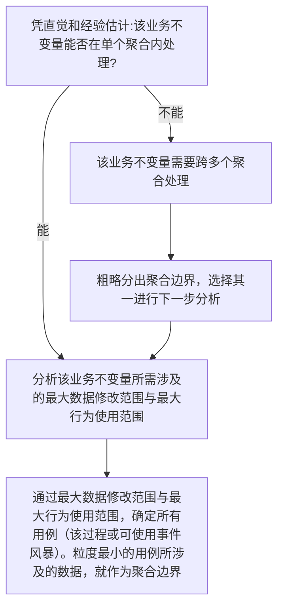

# 面向演化的 DDD × 组件化开发指导文档

> **目的**：
> 本文档不是 DDD 教程，也不是原则清单，而是一份**用于真实项目验证的开发指导文档**。
> 它总结了一种以“抗需求演化”为核心目标的 DDD 落地方式，融合了：
>
> * DDD 的一致性与业务不变量思想
> * 组件化 / 角色化设计
> * Use Case 驱动的模型组装方式

---

## 一、核心设计目标

本指导文档以以下原则为**唯一最高目标**：

> **当需求发生变化时，修改是否能被局部化，并且以“新增”为主，而非修改既有稳定代码。**

所有设计取舍，都围绕这一点展开。

---

## 二、背景说明

* **业务不变量**：由需求得到的“必须始终成立的业务规则”，举例：
  * 订单总价 = 各项明细之和
  * 用户名全局唯一
  * 库存不能为负数
  * 每个用户只能有一个默认收货地址
  * 用户支付订单时，实际支付金额要受各种优惠活动影响

每一条业务不变量，必须能在代码中找到唯一的位置来表达和维护它。

* **一致性**：事务对数据一致性的要求，分为两类：
  * 强一致性：事务内部的所有数据必须始终保持一致，单个事务引发的修改必须全部成功或全部失败。
  * 最终一致性：在业务需要多事务协作完成时，整个系统中被修改的数据允许在短时间内不一致，但最终必须达到一致状态。

本文默认对业务仅要求最终一致性。如果您的系统需要业务具有强一致性，本文概不适用。

* **应用层**：本文的应用层，默认指“命令处理器（Command Handler）”或“流程编排器（Saga）”等负责业务流程编排的代码。

---

## 三、聚合的设计原则

### 3.1 聚合的唯一存在理由

> **聚合存在的唯一理由，是“在业务流程中，需求设计上具有强一致性的数据必须被定义成聚合，以在代码上仍保证强一致性”；需求设计上不需要强一致性的数据，则必须被拆分成多个聚合，以避免不必要的强一致性约束。**

判断一个字段 / 行为是否应进入同一聚合，只问一个问题：

> **它们是否必须在同一事务中保持一致？**

* 是 → 同一聚合
* 否 → 必须拆分

基于该原则，在进行聚合设计时，应时刻参照3.3与3.4章节的方法与示例。

---

### 3.2 规则分类阶段-区分规则类型

将用户的自然语言翻译并落地代码上是开发者唯一的任务。但从自然语言描述上能翻译出多少东西，则决定了系统的设计质量。

本阶段作为预热阶段，目标是：教会开发者如何将自然语言描述的用户需求分析为不同类型的规则，并明确每类规则的发生位置和实现方式。  

以如下的需求为例：

1. 只有 HR 角色的用户才能修改员工薪资
2. 各个部门的薪资总计不得超过各自部门的薪资预算
3. 如果员工离职了，则不允许修改其薪资

现在我们开始做分析：

首先是最简单的，非业务性的规则：这些内容用户通常不会直接说出来，但开发者必须实现，比如：

* 薪资字段不能为空
* 薪资字段必须大于0
* 薪资字段不能超过8位数字

我们把这些规则称为**技术规则**，它们与业务无关，很多时候是为了适应技术限制（数据库字段长度）而存在的。技术规则应当在接口层或者校验层进行处理，因为它们与业务逻辑完全无关，所以尽可能在系统外层处理。

接下来是**访问控制规则**。本来访问控制规则也是一种业务规则，但由于它的特殊性：几乎在所有系统中，执行其他业务都要先经过访问控制的检查，以至于访问控制几乎都像是架构上单独的一层/一个模块一样存在，因此我们单独把它拿出来说。（如果你的系统就是专门做访问控制的人事系统之类的，那么访问控制规则就是普通的业务规则。）

访问控制规则不会影响系统中**有**哪些功能，而是决定了哪些用户可以访问哪些功能。在上面的需求中，规则1 **只有 HR 角色的用户才能修改员工薪资** 就是一个访问控制规则。

我们暂时不用关注访问控制规则的实现细节，我们只用先明确访问控制发生的位置：它发生在应用层，且通常是应用层的第一步。访问控制规则的实现细节可能会涉及到一些技术性的东西，比如权限表、权限缓存、权限检查组件等等，但这些都不影响访问控制规则本身的业务含义。

抛开技术规则和访问控制规则，我们剩下的规则就是**业务规则**了。业务规则是用户会说的，且直接关系到系统的功能和行为的规则。在上面的需求中，规则2 **各个部门的薪资总计不得超过各自部门的薪资预算** 和规则3 **如果员工离职了，则不允许修改其薪资** 就是两个业务规则。

让我们拿两个用例出来分析一下两个业务规则，显然规则3要简单一些，我们先分析它：

**用例1**：修改一个已离职员工的薪资

我们很容易想到的是：首先要检查员工是否离职了，如果离职，业务终止并返回错误；如果没有离职，则继续修改薪资。但我们立刻就会发现，这条规则并不“全面”。我们可以问出这样的逆否命来验证：如果员工没有离职，就一定允许修改薪资吗？我们可能暂时不知道答案，但“不知道答案”已经足够我们做出决策——留给应用层的业务流程是：修改一个员工的薪资。而放到领域层的业务规则是：如果要修改一个员工的薪资，必须先检查该员工能否被修改薪资（比如是否离职了）。具体如何决定员工能否被修改薪资，可能涉及数量不定、有一定复杂性的业务规则，可能需要持续维护修改薪资的条件（比如未来可能还会有其他条件，比如员工是否处于试用期等等）。因此我们可以得出结论：规则3 **如果员工离职了，则不允许修改其薪资** 的业务不变量是：**员工的薪资可以被修改。如果要修改一个员工的薪资，必须先检查该员工能否被修改薪资**。这个业务不变量应该被局部化到某个聚合中。

**用例2**：修改一个部门的薪资总计

基于用例1的分析，我们已经知道了如何修改一个员工的薪资，而接下来我们要分析的规则2 **各个部门的薪资总计不得超过各自部门的薪资预算** 显然对修改员工薪资有影响。有些人认为从逻辑关系上讲，规则2是修改员工薪资的”前置条件“，这种说法暗示了规则2应该像是访问控制规则一样，被率先检查，然后修改员工薪资才被实际执行。

我们应该能想到，承载**员工的薪资可以被修改。如果要修改一个员工的薪资，必须先检查该员工能否被修改薪资**这个业务不变量的那个聚合显然不应该包含其他员工的薪资总计和部门的薪资预算（如果非得举出个不依赖直觉的理由，见3.3，相关原则被总结到了3.3的步骤3中）。因此我们可以做出第一个结论：规则2 **各个部门的薪资总计不得超过各自部门的薪资预算** 必须涉及多聚合协同工作。以往这种情况会被设计为领域服务，以确保“强一致性”。（这地方恐怕必须澄清一下，有些人说设计领域服务的原因是“确保所有业务规则都在领域层被表达”，但本来“确保所有业务规则都在领域层被表达”的原因就是“确保强一致性”。）而现在，我们已经不再追求强一致性，转而寻求最终一致性，那么领域服务的功能被Saga等流程编排方式取代了（详见另一篇文章《将领域服务这一概念从DDD中清除出去》，如果你非得打破砂锅问到底，了解为什么现在不再追求强一致性，转而寻求最终一致性，那还是请自行学习）。既然如此，我们必须指出业务不变量如今分为两类：**单聚合内的业务不变量**和**跨聚合的业务不变量**。规则3 **如果员工离职了，则不允许修改其薪资** 就是单聚合内的业务不变量，而规则2 **各个部门的薪资总计不得超过各自部门的薪资预算** 就是跨聚合的业务不变量。单聚合内的业务不变量由领域层的单个聚合来表达，而跨聚合的业务不变量则由应用层的流程编排来表达。

好，做个总结，从三句自然语言上，我们分析出了一条技术规则、一个访问控制规则、两个业务规则；两个业务规则一个是单聚合内的业务不变量，一个是跨聚合的业务不变量。我们把这些规则分类的目的在于：明确它们发生的位置和实现方式，以确保它们被正确地表达和维护。

> 一条技术规则是：薪资字段不能为空、必须大于0、不能超过8位数字。承载技术规则的代码应该在接口层或者校验层进行处理。
> 
> 一个访问控制规则是：只有 HR 角色的用户才能修改员工薪资。承载访问控制规则的代码应该在应用层的第一步或专用的访问控制层处理。
> 
> 一个单聚合内的业务不变量是：员工的薪资可以被修改。如果要修改一个员工的薪资，必须先检查该员工能否被修改薪资。承载单聚合内的业务不变量的代码应该在领域层的单个聚合中处理。
> 
> 一个跨聚合的业务不变量是：各个部门的薪资总计不得超过各自部门的薪资预算。承载跨聚合的业务不变量的代码应该在应用层的流程编排中处理。

现在，我们建立起了一套分类方法，让我们开始进入实际的设计阶段。

### 3.3 需求设计阶段-识别聚合边界

在这一阶段，才正式开始和甲方的对接，识别业务不变量，并以此为基础来设计聚合边界。我们可以按照以下步骤来进行：

**步骤1**: 识别业务不变量

该阶段主要通过与业务方讨论，识别出系统中的业务不变量。3.2我们已经基本展示了如何从自然语言描述的需求中识别出业务不变量，但在实际项目中，业务不变量的识别往往需要反复讨论和验证，可能需要多次迭代才能最终确定。因此，在这个阶段，我们需要与业务方进行深入的沟通，确保我们对业务不变量的理解是正确的，并且能够覆盖所有重要的业务规则。

在这一步应当注意：

1. 区分“技术规则”与“业务规则”：

我们先回顾一下：技术规则是那些用户通常不会直接说出来，但开发者必须实现的，受技术限制的规则，比如字段不能为空、字段必须大于0等等；而业务规则则是用户会说的，且直接关系到系统的功能和行为的规则，比如订单总价必须等于各项明细之和、用户名必须全局唯一等等。

假设项目现在需要让用户提供自己的身份证号并存储，我们理所应当的想到应该做一下数据校验：对身份证号格式做校验，是业务还是非业务？

我们可以假设一个“完全不懂业务的人”，比如一位对中国完全不了解的外国人：他根本不知道身份证号是多少位，有多少数字多少字母，遵循什么规则；但他知道一些常识，比如身份证号怎么也得不小于一个字符，不大于50个字符——或者40个？大致上反正是这样的——这就是技术方面而非业务方面的问题。

因此我们可以明确指出：对身份证号格式做校验要分两部分处理：在接口层处理技术问题，比如对参数做非空校验、长度大于1小于50的校验；至于处理业务问题，比如老身份证号15位，新身份证号18位，最后一位可能是X，中间哪几位要符合年月日格式等等，这些逻辑的处理显然不需要任何跨聚合的业务不变量，因此应该被局部化到一个聚合中，所以是在领域层处理。

1. 区分“业务本身”与“与业务等价的技术实现”

以前面提到的身份证号为例，业务不变量是“用户提供的身份证号必须符合中国身份证号的规则”，而不是“用户提供的身份证号必须符合正则表达式`^\d{15}$|^\d{17}[\dX]$`”。又比如，业务不变量是“账户转账时，转出账户必须处于可用状态且余额充足”，而不是“账户转账时，转出账户的状态字段必须为"Available"，余额字段必须大于转账金额”。

上述要求意味着，领域层在处理身份证号的相关业务时，应该只能调用`IdentifyCardNumberIsValid()`方法来得知身份证号是否合法，而不应该看见调用了`Regex.IsMatch(cardNumber, @"^\d{15}$|^\d{17}[\dX]$")`之类的代码来得知身份证号是否合法；领域层在处理转账业务时，应该只能调用`CheckAccountCanTransferOut()`方法来得知账户是否可转出，而不应该看见调用了`account.Status == "Available" && account.Balance > transferAmount`来得知账户是否可转出。这一层封装的目的在于：当业务不变量发生变化时，比如身份证号的规则发生了变化，或者账户状态字段的值发生了变化，我们只需要修改`IdentifyCardNumberIsValid()`方法或`CheckAccountCanTransferOut()`方法的实现，而不需要修改所有调用了这些方法的代码。如果业务不变量比较简单，在实体内部直接实现就好了；如果业务不变量比较复杂，或者需要被多个实体共享，那么可以抽出一个专门的验证器类来实现这些方法，例如身份证号验证器。（别小看身份证号规则！如果我们要求严格按照中国身份证号的规则来验证，起码也得有百十行代码来实现，远远不是一个正则表达式能搞定的。）

千万不要小看上述问题！如果你的系统就因为身份证号从15位升级到18位，或者因为账户状态字段的值从"Available"改成了"Active"，就需要程序员立刻爬起来加班三天三夜来修改所有相关的代码，那么你就应该意识到你的系统已经被技术细节严重污染了。

**步骤2**: 判定一致性强度

对所有业务不变量，依次分析如下问题：



**步骤3**: 按以下原则进行验证:

1. 聚合内的所有数据，都必须在同一事务内保持强一致性，没有任何用例会小到只需要修改聚合的一部分数据而不需要修改其他数据。如果有这样的用例，则必须拆分聚合。
2. 在应用层编写业务流程时，因一项业务而需要被加载的所有聚合所包含的数据，必须恰好等同于该业务所需读取和修改的数据，不能多于也不能少于。
---

### 3.4 分析流程示例

以设计用户模块为例，假设有如下业务不变量：

1. 用户名全局唯一，且用户能修改用户名
2. 用户有头像、个性签名、个人简介等信息需要展示
3. 用户能通过手机号、邮箱、用户名三种方式登录
4. 用户有多个收货地址，但只能有一个默认收货地址

**分析过程**：
1. 业务不变量1：用户名全局唯一
   * 该业务不变量应完全由用户领域内处理 → 进入步骤2
   * 最大数据修改范围： 用户名字段 → 该业务不变量所涉及的数据只有用户名字段 → 该业务不变量可作为一个聚合边界
   * 最大行为使用范围： 没有复杂的业务行为
   * 结论：设计出 UserName 聚合，包含字段：UserId, UserName
2. 业务不变量2：用户有头像、个性签名、个人简介
   * 该业务不变量应完全由用户领域内处理 → 进入步骤2
   * 最大数据修改范围： 头像、个性签名、个人简介字段
   * 用例分析：用户可以在一次操作中只修改头像/只修改个性签名/只修改个人简介 → 该业务不变量所涉及的数据需要拆分成多个聚合
   * 最大行为使用范围：没有复杂的业务行为
   * 结论：设计出 UserAvatar, UserSignature, UserBio聚合，分别包含字段：
     * UserAvatar 聚合： UserId, AvatarUrl
     * UserSignature 聚合： UserId, Signature
     * UserBio 聚合： UserId, Bio

以上分析了两个简单的业务不变量，下面分章节的3.4与3.5将分别展示更复杂的业务不变量分析示例。

### 3.5 复杂业务分析示例：全功能的登录体系

**需求描述**：
1. 用户可通过手机号、邮箱、用户名登录
2. 登录失败需记录次数，连续失败5次锁定账号30分钟
3. 记录最后一次登录时间

**分析过程**：
1.  **最大数据修改范围**：需求中需要被修改的数据集中于安全状态管理，包括登录失败计数、锁定状态、最后登录时间等。其他所需的数据（如凭证信息）在登录过程中仅需读取，不涉及修改。
2.  **最大行为使用范围**：登录流程中，涉及的业务行为包括凭证校验规则与锁定规则。

**结论**：
我们将该业务拆解为三个独立的维度：**身份索引**、**凭证校验**、**安全状态**。

#### 1. 身份索引（Identification）
登录的第一步是“根据输入找到 UserId”。这是一个索引查找过程。在写模型侧，对应的聚合是：
*   **UserPhone 聚合**：`{ PhoneNumber (Key), UserId }`
*   **UserEmail 聚合**：`{ EmailAddress (Key), UserId }`
*   **UserName 聚合**：`{ UserName (Key), UserId }`

而读模型侧如何从数据库之类的数据源中高效地找到 UserId，属技术问题，无论是在commandHandler里写SQL/维护投影表/使用GraphQL或Elasticsearch都无关建模问题，不在本文讨论范围内。

#### 2. 凭证校验（Configuration）
找到 UserId 后，需要校验凭证。该需求对应的业务不变量为凭证校验规则。我们设计如下聚合来承载：
*   **UserPassword 聚合**：`{ UserId, PasswordHash, Salt }`

#### 3. 安全状态（Runtime State）
登录失败计数、锁定状态，属于“高频写”的数据。该需求对应的业务不变量为锁定规则。我们设计如下聚合来承载：
*   **UserLoginSecurity 聚合**：`{ UserId, FailureCount, LockoutEndTime, LastLoginTime }`
    *   业务规则方法：`CheckLockout()`, `RecordSuccess()`, `RecordFailure(maxRetry)`

**应用层编排示例**：

```csharp
public void Login(string input, string password)
{
    // 1. 从请求上下文中识别用户 ID
    var userId = IdentifyUserId(input);
    if (userId == null) throw new UserNotFoundException();

    // 2. 为了使用锁定规则这一行为，加载相应聚合
    var securityState = repo.Get<UserLoginSecurity>(userId);
    
    // 3. 检查是否锁定
    if (securityState.IsLocked(DateTime.Now)) 
        throw new AccountLockedException(securityState.LockoutEndTime);

    // 4. 为了使用凭证校验规则这一行为，加载相应聚合
    var credential = repo.Get<UserPassword>(userId);

    // 5. 校验逻辑
    if (credential.Verify(password))
    {
        securityState.RecordSuccess(DateTime.Now); // 重置计数，更新时间
        repo.Save(securityState); // 如果有efcore等orm框架并开启自动变更追踪，则可省略
        // 发放 Token...
    }
    else
    {
        securityState.RecordFailure(DateTime.Now); // 增加计数，可能触发锁定
        repo.Save(securityState); 
        throw new PasswordMismatchException();
    }
}
```

### 3.6 集合类业务分析示例：默认收货地址

**需求描述**：用户有多个收货地址，但始终只能有一个默认地址。

**分析过程**：
1.  **最大数据修改范围**：修改地址详情和切换默认地址，二者互不影响。
2.  **最大行为使用范围**：没有复杂的业务行为。

**结论**：
将“地址内容”与“默认设置”拆分。
*   **Address 聚合**：`{ UserId, AddressId, xxx... }`
    *   负责地址内容的增删改
*   **UserDefaultAddress 聚合**：`{ UserId, DefaultAddressId }`
    *   **唯一职责**：维护“谁是默认”这个指针。

当用户修改地址详情时，只加载 `Address`。
当用户切换默认地址时，只加载 `UserDefaultAddress`。

## 四、应用层的正确职责（防止退化为 MVC）

### 4.1 应用层可以做什么

应用层**被允许且必须**：

* 按用例选择要加载哪些聚合
* 决定使用哪些策略 / 角色
* 编排调用顺序
* 组装用例级视图（View / DTO）

### 4.2 应用层绝不能做什么

* ❌ 定义业务规则
* ❌ if/else 决策业务含义
* ❌ 修改或绕过领域不变量

**判断标准**：

> 应用层代码读起来应当像是用户故事，而不应该像业务规则文档。
> 
> 应用层代码的语义应与业务保持完全一致，业务的处理流程要在应用层中清晰可见，但不包括任何业务规则细节。
> 
> 应用层只能将前端传来的命令作为唯一的上下文，并根据该上下文进行业务编排，不允许在编写代码时直接读取任何实体的字段来做编排决策。如果需要确保某些业务流程只能在领域处于某种状态时执行，那么应该在领域层定义一个方法用于判断是否满足该状态。即使是这样，应用层也只能根据该方法的返回值来决定是否立刻**终止**当前业务流程或者触发新的业务流程，而不应该根据该方法的返回值来决定接下来要执行哪些业务流程。

### 4.3 应用层决策的边界示例

**✅ 允许的决策** (基于用例上下文):
```csharp
// 根据操作来源选择策略
var policy = request.Source == "Admin" 
    ? new AdminNamePolicy() 
    : new UserNamePolicy();
user.ChangeName(newName, policy);
```

**❌ 禁止的决策** (基于领域状态):
```csharp
// 这是领域规则,不应在应用层
if (user.VipLevel > 3)
{
    // 错误!这是领域知识
}
```

当然，如果业务规则是“如果用户是VIP4以上，则允许xxx”，那么总得有办法让应用层知道用户的VIP等级，以便做出正确的决策。正确的做法是：在领域层定义一个方法来判断用户是否满足VIP4以上的条件，比如`user.IsVip4OrAbove()`，而不是让应用层直接读取`user.VipLevel`来判断。

```csharp
// 领域层
public bool IsVip4OrAbove()
{
    return this.VipLevel > 3;
}
```

```csharp
// 应用层
// 注意这里的写法：
if (!user.IsVip4OrAbove())
{
    // 立刻终止当前业务流程,比如抛出异常或返回错误结果
    throw new BusinessException("用户VIP等级不足");
}
```

不应该出现如下写法：

```csharp
if (user.IsVip4OrAbove())
{
    // 业务流程xxx
    // 不适当的写法，领域规则不能用来决定下一步流程，它只有终止流程的权力
}
```

更不应该出现如下写法：

```csharp
if (user.IsVip4OrAbove())
{
    // 业务流程1
}
else
{
    // 业务流程2
}
// 这种情况是极端糟糕的，两套业务流程如果在同一处出现，那绝对不是单个问题导致的，而是整个设计思路都被破坏了。请务必避免。
```

但是，如果情况如下：

```csharp
if (user.IsVip4OrAbove())
{
    // 发出一个新的命令，触发另一套业务流程
}
else
{
    // 发出另一个新的命令，触发另一套业务流程

}
// 这种情况是可以接受的，因为它并没有在同一处出现两套业务流程，而是通过发出不同的命令来触发不同的业务流程。只要确保每个业务流程都能独立地被测试和维护，那么这样的设计也是可以接受的。
```

---

## 五、领域模型的“组件化”落地方式

### 5.1 从“胖对象”转向“组合”

不再追求：

```text
一个聚合 = 所有状态 + 所有行为
```

而是：

```text
稳定状态 + 可组合组件 / 策略
```

从大聚合到小聚合的的设计理由是：实际业务中，每一个用户故事往往只涉及少量状态，而大部分状态在该用户故事中并不需要被读取或修改。因此，我们将聚合设计为与每一个用户故事的需求完全匹配的单元，以便在应用层按需加载和组合。

将状态与行为分开定义的设计理由是：在做面向对象设计时，对象的状态比行为更容易率先被确定并保持稳定，而行为往往会随着需求变化而变化。因此，我们选择将“稳定状态”与“可变行为”分离，通过组合不同的行为组件或行为策略来实现行为的变化。

---

### 5.2 组件化的行为

当同一状态需要“完全不同的一套行为”时，采用如下设计方式：

* 不要塞进同一个类
* 不要用 if/else

使用组件对象：

```text
State + ComponentA
State + ComponentB
```

示例：

* 需求是编辑 XML 文档：通过文本编辑组件，可以把xml作为文本编辑/通过树编辑组件，可以把xml作为树编辑
* 需求是计算价格：通过不同的定价策略组件，实现不同的价格计算方式，然后供应用层按需组合使用
* 需求是统计用户在各个业务模块的行为痕迹，比如点赞数量，支付金额，登录情况，停留时长：不对现存的代码做修改，而是新增不同的统计组件，供应用层按需组合使用
---

## 六、领域事件的正确使用方式

如果系统中使用分布式事务，必须使用流程编排（Orchestration），而不是流程编舞（Choreography），以确保应用层能显式记录流程状态，保持业务与代码在语义上的一致。

## 七、数据加载与持久化原则

项目中必须采用CQRS的设计方式，必须明确区分读模型需求和写模型需求，只有写模型会使用聚合，读模型则完全不需要聚合。

### 7.1 写模型设计原则

根据具体用例，只加载必要的聚合，且被加载的聚合所包含的状态必须与业务所需读写的状态一致，不多不少。

---

### 7.2 读模型设计原则

读模型为了性能需求可以使用各种优化方案，包括但不仅限于：

* 跨聚合查询
* 直接 JOIN
* 使用 SQL / View / Projection
* 返回 DTO / ReadModel

读模型唯一的限制是，不允许进行任何业务状态的修改。

---

### 7.3 性能问题

在正确使用读模型的情况下，写模型只加载少量聚合，读模型使用一次投影查询取出需要的数据，聚合设计较小基本不可能影响性能。性能问题通常是因为没有正确使用读模型导致的，而不是因为聚合设计过小导致的。

---

### 7.4 需求变更抗性

考虑如下场景：近一个月以来，因需求的变化，某个用例需要新增读取某个字段A，另一个用例需要删去读取某个字段B。在以往的情况下，为了实现这些需求变更，从领域层的聚合定义开始，代码变动一路向上传导到应用层，一路向下传导到数据库表定义，仅仅为了一个字段的增删，往往需要修改几十处代码。而在本文档所倡导的设计方式下，情况变成了以下几种：

1. 新增的字段A原先不存在于系统中：按需求分析新增相应聚合，或仅对某个极小的聚合新增字段A。数据库新建相应表，或仅对某个极小的表新增字段A。应用层新增加载该聚合或使用该字段A的代码。整个过程仅涉及极少数代码修改，且大部分修改都是新增代码。
2. 新增的字段A原先已存在于系统中：应用层仅需新增加载该字段A所在聚合的代码，领域层和数据库层无需任何修改。

## 八、判断设计是否优秀的五个自检问题

在每次需求评审或重构时，逐条回答：

1. 新需求是否主要通过“新增代码”完成？是否避免修改既有稳定聚合？
2. 此次重构影响的业务不变量有哪些？单聚合内业务不变量是否被领域层的某个聚合承载？跨聚合的业务不变量是否被应用层的流程编排承载？
3. 应用层是否只做选择与编排？业务需求是否与应用层代码语义一致？应用层代码中是否没有任何业务规则细节？
4. 处理业务时是否只加载了必要的聚合？被加载的聚合所包含的状态是否与业务所需读写的状态一致，不多不少？
5. 读模型和写模型是否完全分离？修改其中一者的结构是否完全不影响另一个？
---

## 九、常见反模式（必须明确避免）

* 聚合 = 数据表映射
* 聚合根 = 领域全知对象
* Service 中堆砌业务规则
* 为了 ORM 方便而设计模型
* 用“DDD 原则”替代设计判断

---

## 十、实用的其他文档

### 1. 《fxxkCRUD》：在你放弃温和沟通时，使用该文档作为武器

[查看文档](fxxkCRUD.md)

### 2. 《使用反需求方法寻找隐藏的业务逻辑和系统边界》：当你面对已经存在的胖对象时，使用该文档与团队讨论拆分方案

[查看文档](https://zhuanlan.zhihu.com/p/635297147)

### 3. 以下资料中可看到与本文相近的结论：

tip: 考虑到本文档的使用者仍需面对自己的团队进行布道，以下资料可以用于以增强说服力。我们必须意识到在理念更新的过程中，团队成员需要时间（以笔者本人的经验而言，请将这个时间预期到至少三个月）与多方论据来消化新的设计思路。因此在进行一到两次语言交流后，推荐团队成员自行阅读以下资料以加深理解。（一定要注意他们到底有没有把这些资料读完！如果有人相信你说的是对的只是因为你本人或者以下资料的作者的权威性，那你可能不得不处理他本人！）

#### 用例驱动相关

* [Screaming Architecture](https://blog.cleancoder.com/uncle-bob/2011/09/30/Screaming-Architecture.html)
* 《Clean Code: Fundamentals》 的第七章：Architecture, Use Cases, and High Level Design

#### 整洁/洋葱/六边形/端口适配器架构-应用层外的架构设计

* [Hexagonal Architecture](https://www.happycoders.eu/software-craftsmanship/hexagonal-architecture/)

#### 领域驱动相关

* [Misconceptions About Domain-Centric Architectures](https://medium.com/better-programming/misconceptions-about-domain-centric-architectures-c16bf1c31371)
* [Misconceptions About Domain-Centric Architectures的中文译文：关于以领域为中心的架构的误解](https://zhuanlan.zhihu.com/p/620473550)

#### 事件风暴相关

* [Domain Discovery Facilitation: Make Scale Explicit](https://medium.com/nick-tune-tech-strategy-blog/domain-discovery-facilitation-make-scale-explicit-1bf5b53afa7b)
* [Domain Discovery Facilitation: Make Scale Explicit的中文译文：DDD事件风暴技巧：通过明确规模大小挖掘领域知识](https://zhuanlan.zhihu.com/p/635297525)
